# Konsep Pertanyaan Core - Optional - Specific untuk Template Quisioner Tracer Study

Referensi:
- [Perbandingan Pertanyaan yang di ajukan oleh KEMDIKTI & KEMENKES](Perbandingan%20Pertanyaan%20yang%20di%20ajukan%20oleh%20KEMDIK%2039de039bd7dc80329d24f58dae0d674e.md)
- `schomburg_key_methodology_issues_of_tracer_studies.pdf` (Harald Schomburg, INCHER-Kassel, 2014) — khususnya slide 22 "Complex Approach of Institutional Questionnaires"

## 1. Konsep Dasar (Schomburg, slide 22)

Setiap institusi VET/HE punya kuisioner sendiri, tapi disusun dari kombinasi 3 tingkatan pertanyaan:

| Tier | Sifat Konten | Sifat Pemakaian | Dampak ke Komparabilitas |
|---|---|---|---|
| **Core question** | Fixed, tidak bisa diubah/dihapus | Wajib ada di **semua** versi kuisioner dalam satu proyek | Bisa dibandingkan antar-institusi + jadi bahan monitoring nasional |
| **Optional question** | Fixed (redaksi & skala baku, dari bank yang sama) | Institusi **hanya memilih pakai atau tidak** — bukan mengedit isinya | Bisa dibandingkan, tapi hanya antar-institusi yang sama-sama mengaktifkannya |
| **Specific / individual question** | Bebas, institusi menulis sendiri | Institusi menulis dari nol | Tidak bisa dibandingkan sama sekali (kecuali kebetulan sama antar institusi) |

**Poin kunci:** Optional question bukan berarti "boleh diedit isinya." Redaksi tetap baku/standar — yang opsional adalah keputusan *pakai/tidak pakai*, bukan kontennya. Ini yang membuat "satu template pertanyaan, tapi bisa diatur admin" jadi mungkin: admin tidak membuat pertanyaan baru, admin hanya **toggle on/off** dari satu bank pertanyaan yang sama.

### 1.1 Bagaimana Ketiganya Tersusun dalam Satu Alur (Bukan Diblok Terpisah)

Detail yang mudah terlewat dari slide 22: susunan pertanyaan di visualnya **bukan** "semua Core dulu → baru semua Optional → baru semua Specific" (block per tier). Urutan aslinya justru berselang-seling dalam satu daftar tunggal — persis: Core, Core, Optional, Specific, Core, Core, Optional, Core.

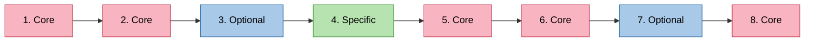

Artinya **tier adalah atribut per pertanyaan** (menentukan boleh-tidaknya dihapus/diedit, dan apakah datanya bisa dibandingkan antar-institusi) — bukan pengelompokan yang memisahkan *posisi tampil* pertanyaan. Konsekuensinya ke desain:

- Admin tidak menyusun kuisioner dalam 3 blok terpisah, melainkan **satu daftar berurutan** di mana tiap posisi bisa diisi Core (tetap ada, tidak bisa dihapus), Optional (kalau diaktifkan, diselipkan di posisi manapun), atau Specific (ditulis admin, boleh diselipkan di tengah-tengah kelompok Core sekalipun).
- Contoh konkret pola ini dengan pertanyaan asli KEMDIKTI ada di bagian 7.4/7.5.

Catatan tambahan dari Schomburg (slide 23): panjang kuisioner **tidak** signifikan menurunkan response rate — response rate lebih dipengaruhi oleh usaha institusi (jumlah kontak, kualitas alamat). Jadi admin tidak perlu takut menambah optional question demi kelengkapan data, selama pertanyaan tetap relevan.

## 2. Menyambungkan ke Temuan KEMDIKTI vs KEMENKES

Dari tabel perbandingan riset, pola yang muncul: KEMDIKTI mewajibkan banyak pertanyaan detail (proses cari kerja, jumlah lamaran, kapan mulai mencari kerja, dst) yang **tidak** diwajibkan KEMENKES.

**Koreksi penting** (lihat juga [Pemetaan Pertanyaan Core vs Optional](Pemetaan%20Pertanyaan%20Core%20vs%20Optional%20(Draft%20Seed%20Data).md) bagian 1): ini **bukan** berarti pertanyaan itu "Core untuk Kemdikbud, Optional untuk Kemenkes". Sesuai definisi Schomburg, Core harus *fixed untuk seluruh proyek* — kalau kewajiban sebuah pertanyaan bergantung pada regulator institusi, pertanyaan itu tetap **Optional**, cuma diberi **tag regulator** supaya gampang difilter/direkomendasikan admin. Jadi tier tidak pernah bercabang per institusi — hanya ada dua tier untuk bank bersama (Core, Optional), plus satu tier tambahan untuk pertanyaan buatan institusi sendiri (Specific, lihat 2.1).

Struktur datanya:

```
Question {
  id
  text
  answer_type          // single choice, multiple choice, matrix/likert, open text, ranking
  scale / options
  variable_code         // untuk data export & analisis, jaga komparabilitas
  tier                  // "core" (kecil, fixed, sama untuk semua institusi) | "optional" | "specific"
  regulator_tags: []    // ["kemdikbud"], ["kemdikbud","kemenkes"], atau [] — HANYA label filter/rekomendasi untuk Optional, TIDAK menentukan tier
  category              // grouping di UI admin, mis. "proses_cari_kerja", "kompetensi"
  time_reference        // before_study / during_study / after_study / present
  depends_on            // skip-logic, bisa merujuk pertanyaan tier apa pun (core/optional/specific)
  owner_institution_id  // null = bank bersama (core/optional); diisi institution_id kalau tier = "specific"
}
```

Saat admin membuat template:

- **Core** selalu ada dan sama untuk semua institusi — bukan hasil perhitungan dari regulator institusi.
- **Optional** satu bank yang sama untuk semua institusi; `regulator_tags` cuma dipakai untuk fitur "aktifkan semua yang bertag Kemdikbud" di UI admin (rekomendasi/bulk-toggle) — bukan penentu boleh-tidaknya dipakai institusi lain.
- **Specific** ditulis admin institusi sendiri (lihat 2.1).

Efeknya: satu bank pertanyaan nasional melayani institusi apa pun regulatornya tanpa perlu template terpisah — admin cukup toggle Optional yang relevan (dibantu filter tag) dan menambahkan Specific bila perlu.

### 2.1 Bagaimana Specific Question Masuk ke Bank yang Sama

Secara struktur data, Specific question **tidak berbeda tabel** dari Core/Optional — sama-sama baris `Question` — bedanya:

- `owner_institution_id` diisi institusi pembuatnya (bukan `null`) → hanya institusi itu yang bisa melihat/memakai/mengedit pertanyaan tsb.
- `regulator_tags` selalu kosong — tidak relevan untuk komparasi lintas institusi.
- `variable_code` diberi prefix scope institusi (mis. `UNVX_CUSTOM_01`) supaya tidak tabrakan dengan `variable_code` bank bersama, dan supaya jelas saat pelaporan bahwa datanya di luar agregasi nasional.
- `depends_on` boleh merujuk ke pertanyaan **Core atau Optional mana pun** milik bank bersama, tidak terbatas ke sesama Specific — misalnya sebuah Specific question institusi hanya muncul kalau responden menjawab pertanyaan Optional tertentu dengan nilai tertentu (contoh lengkap ada di bagian 7.5).

Menyimpan Specific di tabel yang sama (bukan tabel terpisah) penting supaya alur render, evaluasi `depends_on`, dan penyimpanan hasil (bagian 6, 7) bisa memakai mekanisme yang identik untuk ketiga tier — tidak perlu logic bercabang di Survey Delivery Service hanya karena tier berbeda.

### Alur Penentuan Tier Pertanyaan (Sistem)

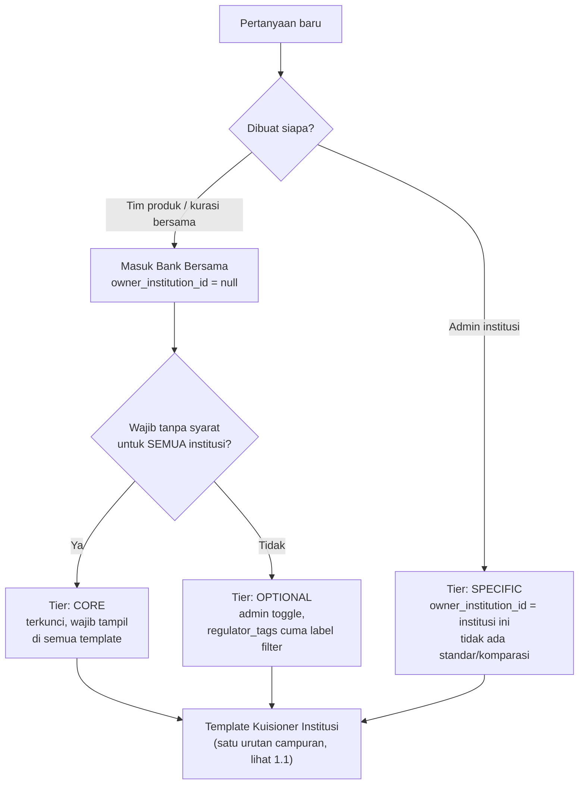

## 3. Alur Admin (UX) yang Disederhanakan

1. **Pilih gelombang survei** (mis. exit survey / Graduate Survey 1-2 tahun / Graduate Survey 4-5 tahun — bukan lagi memilih regulator, karena Core tidak bergantung regulator).
2. Sistem otomatis meng-include semua **Core question** (sama untuk semua institusi, apa pun regulatornya) — ditampilkan tapi terkunci (read-only), supaya admin tetap sadar apa yang wajib ada.
3. Admin membuka **Bank Pertanyaan Optional**, difilter per kategori (kompetensi, proses cari kerja, kesesuaian kerja, dll — sejalan dengan struktur A–I di slide 29 Schomburg: sosiodemografi, masa studi, transisi kerja, dst). Admin tinggal **toggle per kategori atau per item**.
4. Admin bisa menambah **Specific question** kapan saja selama menyusun template — bukan hanya tahap akhir — dan **menyisipkannya di posisi manapun** dalam urutan tanya-jawab, termasuk di antara pertanyaan Core/Optional (pola campuran ala slide 22, lihat bagian 1.1), bukan selalu ditumpuk di akhir kuisioner.
5. **Save as Template** — disimpan dengan versioning, supaya kalau template diubah untuk angkatan berikutnya, data angkatan lama tidak ikut berubah. Ini penting untuk mendukung desain longitudinal/panel (lihat bagian 4).

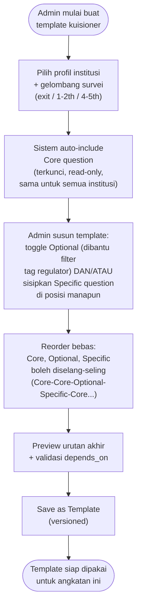

## 4. Metadata Tambahan yang Layak Dipertimbangkan (dari Schomburg)

- **`time_reference`** per pertanyaan (before/during/after study, present) — berguna bila Foxtrot ingin mendukung **desain panel 3 gelombang**: exit survey (saat lulus) → Graduate Survey I (1–2 tahun) → Graduate Survey II (4–5 tahun), alih-alih 1x survey monolitik berisi ~300–600 variabel (slide 27–31). Kuisioner tiap gelombang jadi lebih pendek dan fokus, kualitas data lebih baik, dan alamat kontak lulusan bisa dikumpulkan lebih awal (saat masih mahasiswa) untuk mengurangi biaya pencarian alamat di gelombang berikutnya.
- **Skip-logic / `depends_on`** eksplisit di level pertanyaan — sudah tersirat di tabel KEMDIKTI riset ("Jika menurut anda pekerjaan anda saat ini tidak sesuai... mengapa anda mengambilnya?" hanya relevan jika status kerja tidak sesuai jurusan).
- **Indikator keberhasilan kerja** (slide 19) sebaiknya dikategorikan objektif (lama cari kerja, status kerja, gaji, kesesuaian jabatan/ISCO, kesesuaian tugas kerja) vs subjektif (persepsi kesesuaian, persepsi pemanfaatan kompetensi, persepsi status, otonomi kerja, kepuasan kerja) — berguna sebagai sub-kategori di bank Optional question.

## 5. Langkah Lanjutan (Belum Dikerjakan)

- [ ] Petakan seluruh pertanyaan KEMDIKTI & KEMENKES dari tabel perbandingan ke tier Core/Optional secara eksplisit (siap jadi seed data).
- [ ] Rancang skema data / struktur tabel konkret untuk implementasi ke sistem Foxtrot.
- [ ] Desain wireframe alur admin (bank pertanyaan, toggle, preview template).

## 6. Gambaran Arsitektur (Architecture)

Ini masih rancangan kasar (belum final) untuk menerjemahkan konsep di atas menjadi sistem. Tujuannya memastikan satu bank pertanyaan bisa dipakai lintas institusi/regulator, template bisa di-versioning, dan data core question tetap bisa diagregasi untuk pelaporan nasional.

### 6.1 Entity Relationship (draf skema data)

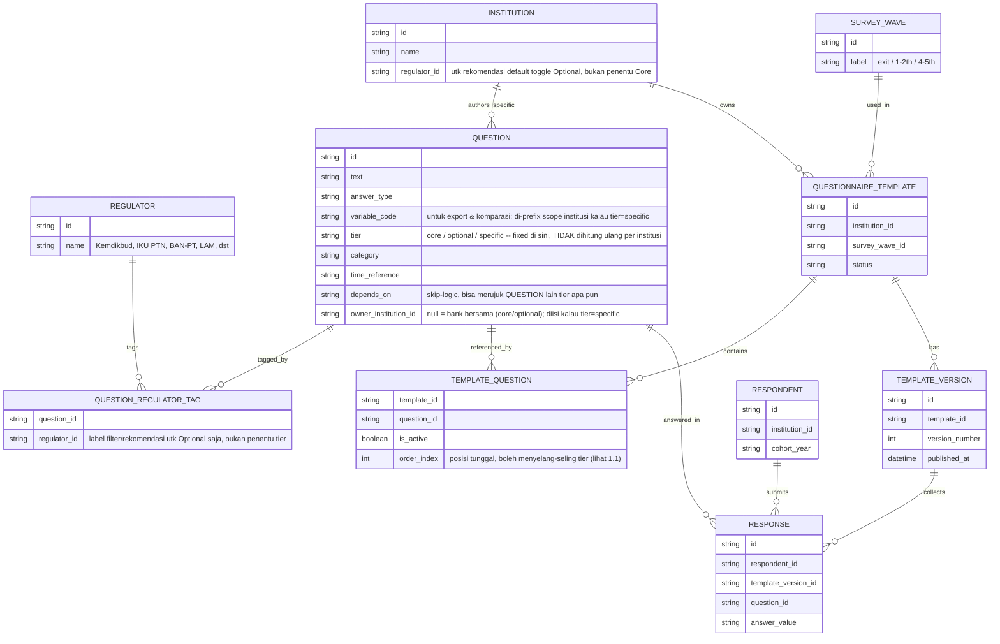

### 6.2 Komponen Sistem & Alur Data

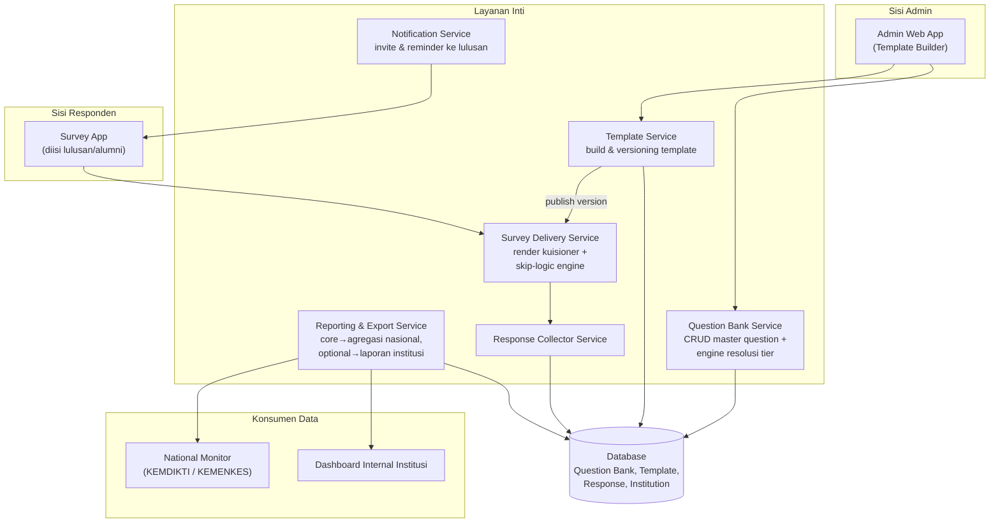

### 6.3 Catatan Desain Penting

- **Tier sudah *given* di level `QUESTION`**, bukan dihitung ulang per institusi — `regulator_tags`/`QUESTION_REGULATOR_TAG` cuma dipakai Question Bank Service untuk fitur filter & bulk-toggle rekomendasi di Optional Bank ("aktifkan semua bertag Kemdikbud"), bukan untuk menentukan core/optional. Ini menghilangkan kebutuhan logic kondisional per institusi yang tadinya ada di draft awal.
- **Specific question tunduk pada `owner_institution_id`** — Question Bank Service wajib memastikan institusi A tidak bisa melihat/memakai Specific question milik institusi B saat browsing bank, walau secara teknis satu tabel `QUESTION` dipakai bersama untuk ketiga tier.
- **Template versioning bersifat immutable setelah publish** — begitu `TEMPLATE_VERSION` dipakai untuk mengumpulkan respon (`RESPONSE` sudah terikat ke `template_version_id`), perubahan template berikutnya harus membuat versi baru, bukan menimpa versi lama. Ini menjaga data historis tetap valid untuk analisis longitudinal (bagian 4).
- **`variable_code`** di setiap `QUESTION` adalah kunci supaya `RPT` (Reporting & Export Service) bisa menyusun data lintas institusi/lintas tahun secara konsisten, terlepas dari perubahan urutan atau redaksi tampilan.
- **Notification Service** relevan mengingat catatan Schomburg: response rate lebih ditentukan oleh usaha kontak (jumlah reminder, kualitas alamat) dibanding panjang kuisioner — jadi ini bukan komponen tempelan, tapi bagian penting dari kualitas data.
- **Reporting & Export Service** perlu memisahkan dua jalur laporan: (a) data Core question → agregasi ke National Monitor sesuai regulator, (b) data Core + Optional → dashboard internal institusi. Data Specific question hanya masuk ke dashboard internal, tidak pernah ke National Monitor.

## 7. Alur Interaktif untuk Responden (Runtime Rendering)

Bagian 3 & 6 menjelaskan bagaimana **admin** menyusun template (design-time). Bagian ini menjelaskan bagaimana **responden/lulusan** akhirnya melihat pertanyaan optional yang relevan saat mengisi kuisioner (runtime) — termasuk supaya kuisioner terasa interaktif (pertanyaan lanjutan muncul sesuai jawaban sebelumnya, bukan satu formulir statis panjang).

### 7.1 Dua Lapis Keputusan yang Berbeda

Penting dipisahkan, karena sering tertukar:

| Lapis | Kapan terjadi | Siapa yang menentukan | Contoh |
|---|---|---|---|
| **Inklusi (design-time)** | Saat admin menyusun template | Admin, via toggle di Bank Pertanyaan Optional, atau menulis & menyisipkan Specific question (bagian 3) | "Institusi ini mengaktifkan section Proses Pencarian Kerja atau tidak"; "Institusi menambah pertanyaan khas alumni mereka sendiri" |
| **Percabangan (runtime)** | Saat responden mengisi kuisioner | Sistem, berdasarkan `depends_on` / rule dari jawaban responden — berlaku untuk Core, Optional, **maupun Specific** | "Section Proses Pencarian Kerja hanya muncul kalau responden menjawab status = sedang mencari kerja"; "Specific question institusi hanya muncul kalau responden menjawab Optional tertentu dengan nilai tertentu" |

Jadi satu pertanyaan optional bisa saja **sudah diaktifkan admin** di template, tapi **tetap tidak muncul** ke responden tertentu karena jawabannya tidak memenuhi syarat `depends_on`. Kedua lapis ini independen tapi berurutan: inklusi dulu (menentukan apa yang *mungkin* muncul), lalu percabangan (menentukan apa yang *benar-benar* muncul untuk responden itu).

### 7.2 Contoh Percabangan Nyata (dari data KEMDIKTI)

Pertanyaan gate klasik di tabel riset kamu — "Jelaskan status Anda saat ini?" — cocok jadi *gate question* yang menentukan section optional mana yang tampil:

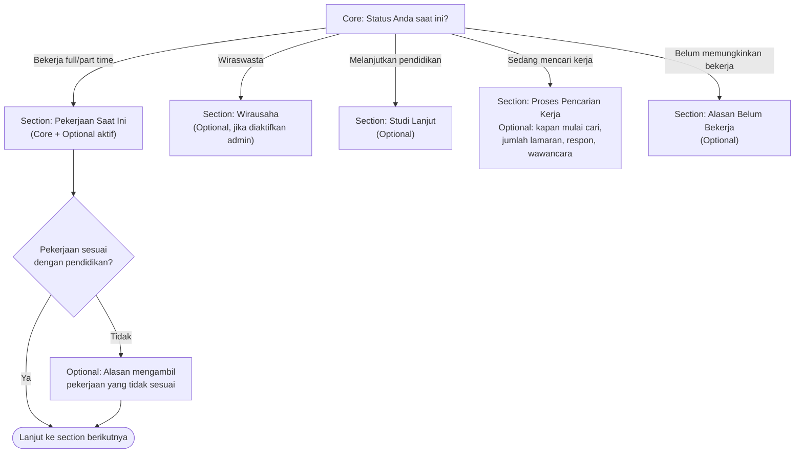

Semua cabang di atas (G1–G6) tetap tunduk ke lapis inklusi: kalau admin institusi tersebut tidak mengaktifkan section "Wirausaha" saat bikin template, cabang `G2` tidak pernah ada di daftar pertanyaan sama sekali — bukan cuma disembunyikan.

### 7.3 Bagaimana Engine Bekerja Saat Responden Mengisi

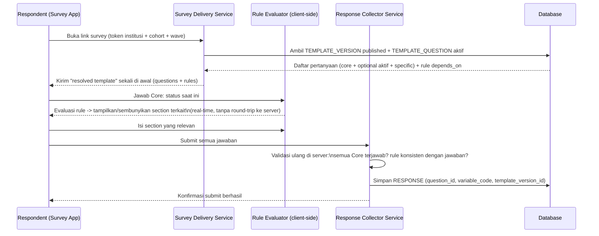

Poin penting dari alur ini:

- **Resolved template diambil sekali di awal**, bukan tanya-ke-server tiap kali responden menjawab satu pertanyaan — supaya transisi antar-section terasa instan/interaktif (mirip Typeform), bukan lambat karena bolak-balik ke server.
- **Evaluasi rule di client-side** untuk pengalaman interaktif, **tapi divalidasi ulang di server** saat submit (Response Collector Service) — supaya responden tidak bisa memanipulasi state browser untuk melewati pertanyaan Core yang wajib, atau mengirim jawaban section yang harusnya tidak relevan untuknya.
- **`depends_on` cukup disimpan di level `QUESTION`** (bagian 2, 6.1) untuk Core maupun Optional bank bersama. Untuk Specific question, `depends_on` juga disimpan di baris `QUESTION` miliknya sendiri (di-scope oleh `owner_institution_id`) — tidak perlu tabel/kolom override terpisah di `TEMPLATE_QUESTION`, karena Specific memang baris unik per institusi sejak awal.
- **Section-level gating** (bukan per-pertanyaan satu-satu) lebih mudah dikelola untuk kuisioner besar (300–600 variabel seperti disebut Schomburg) — gate question menentukan *section* mana yang aktif, section berisi campuran Core+Optional+Specific yang sudah diresolusi dari lapis inklusi.

### 7.4 Contoh Konkret: Tampilan ke Responden & Hasil Data

Memakai pertanyaan nyata dari [Pemetaan Pertanyaan Core vs Optional](Pemetaan%20Pertanyaan%20Core%20vs%20Optional%20(Draft%20Seed%20Data).md), disusun **berselang-seling** (bukan per blok tier) sesuai pola 1.1. Skenario: **Andi**, lulusan Universitas X (UNVX). Template UNVX sudah mengaktifkan grup Optional bertag `kemdikbud` (proses pencarian kerja), **tidak** mengaktifkan Optional `Q2 - sumber dana kuliah`, dan admin UNVX menambahkan **2 Specific question** milik mereka sendiri, disisipkan di dua posisi berbeda (bukan ditumpuk di akhir).

#### 7.4.1 Urutan Layar yang Dilihat Andi

1. **[Core]** *"Status Anda saat ini?"* → Andi jawab **"Tidak kerja, sedang mencari kerja."**
   - `depends_on` section "Proses Pencarian Kerja" (Optional, tag `kemdikbud`, aktif di template) → **muncul**, jawaban Andi memenuhi syarat.
   - Q11 "Alasan kerja tidak sesuai pendidikan" → **tidak muncul**, syarat `depends_on` (status = "bekerja tidak sesuai") tidak terpenuhi.
   - Q2 "Sumber dana kuliah" → **tidak pernah muncul** — bukan soal jawaban Andi, tapi admin UNVX memang tidak mengaktifkannya (lapis inklusi).
2. **[Specific – UNVX]** *"Apakah Anda tertarik bergabung dengan Ikatan Alumni UNVX?"* → disisipkan admin tepat setelah gate question, sebelum masuk section Optional — dijawab.
3. **[Optional – tag `kemdikbud`]** *"Kapan Anda mulai mencari pekerjaan?"* → dijawab.
4. **[Optional – tag `kemdikbud`]** *"Bagaimana cara Anda mencari pekerjaan tersebut?"* → **dilewati kosong** (field tidak wajib).
5. **[Optional – tag `kemdikbud`]** *"Berapa perusahaan yang sudah Anda lamar?"* → dijawab: **12**.
6. **[Optional – tag `kemdikbud`]** *"Berapa yang merespons lamaran Anda?"* → dijawab.
7. **[Optional – tag `kemdikbud`]** *"Berapa yang mengundang wawancara?"* → dijawab.
8. **[Optional – tag `kemdikbud`]** *"Aktif mencari kerja dalam 4 minggu terakhir?"* → dijawab.
9. **[Specific – UNVX]** *"Apakah info lowongan tersebut Anda dapat dari Career Center UNVX?"* → disisipkan admin **setelah** section pencarian kerja, dengan `depends_on` merujuk ke pertanyaan **Optional** No. 5 (jumlah lamaran > 0) — muncul karena Andi menjawab 12 lamaran. Ini contoh Specific question yang bergantung ke jawaban Optional, bukan cuma ke Core.
10. **[Core]** *"Kompetensi yang dikuasai saat lulus vs dibutuhkan pekerjaan saat ini"* → dijawab.
11. **[Core]** *"Penekanan metode pembelajaran di program studi"* → dijawab.
12. Submit.

Urutan di atas kalau ditulis singkat: **Core → Specific → Optional×6 → Specific → Core → Core** — persis semangat pola berselang-seling di slide 22 (bagian 1.1), bukan Core-block lalu Optional-block lalu Specific-block.

#### 7.4.2 Hasil Data yang Tersimpan

```json
{
  "respondent_id": "R-2026-00123",
  "template_version_id": "TV-UNVX-LULUSAN-v3",
  "responses": [
    { "question_id": "Q1",   "variable_code": "STATUS_SAAT_INI",           "tier": "core",     "status": "answered",              "value": "sedang_mencari_kerja" },
    { "question_id": "S1",   "variable_code": "UNVX_ALUMNI_INTEREST",      "tier": "specific", "status": "answered",              "value": "ya" },
    { "question_id": "Q2",   "variable_code": "SUMBER_DANA_KULIAH",        "tier": "optional", "status": "excluded_from_template", "value": null },
    { "question_id": "Q5",   "variable_code": "MULAI_CARI_KERJA",          "tier": "optional", "status": "answered",              "value": "1_bulan_setelah_lulus" },
    { "question_id": "Q6",   "variable_code": "CARA_CARI_KERJA",           "tier": "optional", "status": "item_nonresponse",       "value": null },
    { "question_id": "Q7",   "variable_code": "JUMLAH_LAMARAN",            "tier": "optional", "status": "answered",              "value": 12 },
    { "question_id": "Q8",   "variable_code": "JUMLAH_RESPON_LAMARAN",     "tier": "optional", "status": "answered",              "value": 3 },
    { "question_id": "Q9",   "variable_code": "JUMLAH_WAWANCARA",          "tier": "optional", "status": "answered",              "value": 2 },
    { "question_id": "Q10",  "variable_code": "AKTIF_CARI_KERJA_4MGG",     "tier": "optional", "status": "answered",              "value": true },
    { "question_id": "S2",   "variable_code": "UNVX_CAREER_CENTER_SOURCE","tier": "specific", "status": "answered",              "value": "tidak", "depends_on": "Q7 > 0" },
    { "question_id": "Q11",  "variable_code": "ALASAN_KERJA_TDK_SESUAI",   "tier": "optional", "status": "not_shown",              "value": null, "skip_reason": "depends_on:Q1 != bekerja_tidak_sesuai" },
    { "question_id": "Q3",   "variable_code": "KOMPETENSI_A_B",           "tier": "core",     "status": "answered",              "value": { "A": 4, "B": 5 } },
    { "question_id": "Q4",   "variable_code": "METODE_PEMBELAJARAN",       "tier": "core",     "status": "answered",              "value": [ "diskusi_kelompok", "studi_kasus" ] }
  ]
}
```

Perhatikan `S1` dan `S2` (Specific milik UNVX): `variable_code`-nya diberi prefix `UNVX_` (scope institusi, tidak akan muncul di agregasi nasional manapun), dan `S2` menyertakan `depends_on` yang merujuk ke **Q7** — pertanyaan Optional, bukan sesama Specific — membuktikan `depends_on` lintas-tier berjalan seperti dirancang di bagian 2.1.

Tiga status "kosong" di atas sengaja dibedakan — ini langsung menjawab poin *"Differentiation of missing values (e.g. filter, item nonresponse, drop-out)"* dari Schomburg (slide 35), yang kalau tidak dipisahkan bisa bikin analisis data keliru (menyamakan "memang tidak relevan" dengan "responden malas jawab"):

| Status | Arti | Ditentukan oleh |
|---|---|---|
| `excluded_from_template` | Pertanyaan tidak pernah jadi bagian kuisioner institusi ini | Lapis inklusi (admin, design-time) |
| `not_shown` | Pertanyaan ada di template, tapi tidak relevan untuk responden ini | Lapis percabangan (`depends_on`, runtime) |
| `item_nonresponse` | Pertanyaan ditampilkan, responden memilih tidak menjawab | Perilaku responden |
| `answered` | Terjawab | Perilaku responden |

Kalau nanti responden keluar sebelum submit, seluruh sisa pertanyaan yang belum ia lalui idealnya diberi status `drop_out` (bukan `item_nonresponse`) — sesuai pembedaan yang sama di slide 35, supaya tim analisis bisa menghitung *drop-out rate* terpisah dari *item non-response rate*. Status ini berlaku sama untuk ketiga tier, termasuk Specific.

### 7.5 Ringkasan: Aturan Penyisipan Specific ke Alur Dinamis

- Specific question **bukan** ditumpuk otomatis di akhir kuisioner — admin menyisipkannya di posisi manapun saat menyusun template (bagian 3), termasuk di antara pertanyaan Core.
- Specific question **boleh punya `depends_on`** yang merujuk ke Core maupun Optional (bukan cuma sesama Specific) — memungkinkan pertanyaan lanjutan yang sangat kontekstual untuk institusi tsb tanpa mengubah bank bersama.
- Karena disimpan di tabel `QUESTION` yang sama (bagian 2.1, 6.1), Survey Delivery Service **tidak butuh logic terpisah** untuk merender Specific — cukup satu resolved template berisi campuran ketiga tier, diurutkan oleh `order_index` yang sama (bagian 6.1).
- Yang tetap eksklusif untuk Specific: tidak masuk agregasi National Monitor (bagian 6.3), dan hanya terlihat/terpakai oleh institusi pemiliknya (`owner_institution_id`).

## 8. Studi Kasus: Penerapan di Aplikasi KarirLink (As-Is vs To-Be)

### 8.1 Kondisi Saat Ini (As-Is)

Modal "Buat Kuesioner" di KarirLink saat ini menyediakan **4 template terpisah**:

| Template | Deskripsi | Yang sebenarnya berbeda |
|---|---|---|
| **Template Lengkap** | Kuesioner lulusan berdasarkan kebutuhan Kemdikbud, IKU PTN, BAN-PT, dan semua LAM | Optional = hampir semua tag regulator pre-aktif |
| **Template Kemdikbud** | Kuesioner lulusan berdasarkan kebutuhan Kemdikbud saja | Optional = hanya tag `kemdikbud` pre-aktif |
| **Template Pengguna Lulusan** | Kuesioner kepuasan pengguna lulusan berdasarkan kebutuhan BAN-PT & LAM | Audiens berbeda (employer, bukan lulusan) — bank pertanyaan terpisah, lihat [Pemetaan bagian 5](Pemetaan%20Pertanyaan%20Core%20vs%20Optional%20(Draft%20Seed%20Data).md#5-draft-untuk-survei-pengguna-lulusan-employer-survey) |
| **Template Kosong** | Kuesioner dari awal untuk survei lulusan | Optional = tidak ada yang pre-aktif, semua manual |

Kalau dipetakan ke konsep di dokumen ini (sudah dikoreksi di bagian 2 & 8.2), **3 dari 4 template (Lengkap, Kemdikbud, Kosong) sebenarnya adalah template yang sama, dengan Core yang identik** — bedanya cuma kombinasi `regulator_tags` mana di bank **Optional** yang di-pre-aktifkan sebagai rekomendasi, bukan kombinasi Core.

Masalah pendekatan 4-template terpisah:

- Kalau ada standar berubah (mis. BAN-PT update instrumen), harus di-update di **lebih dari satu tempat** (Template Lengkap dan tempat lain yang memuat pertanyaan BAN-PT), rawan drift/tidak sinkron.
- Kalau ada regulator/standar baru muncul, solusinya menambah **kartu ke-5**, ke-6, dst — tidak scalable.
- Tidak ada jalan tengah: institusi yang cuma butuh Kemdikbud + IKU PTN (tanpa BAN-PT/LAM) tidak difasilitasi kombinasi manapun, harus pilih "Lengkap" (kebanyakan) atau "Kosong" (kekurangan) lalu edit manual.

### 8.2 Kondisi Baru (To-Be) — Satu Alur, Bukan Satu Formulir Statis

"Satu template" di sini maksudnya **satu titik masuk pembuatan kuesioner** yang mengganti pilihan kartu dengan **konfigurasi standar** — bukan menghapus keempat kebutuhan tadi, tapi menyatukan mekanismenya jadi satu wizard:

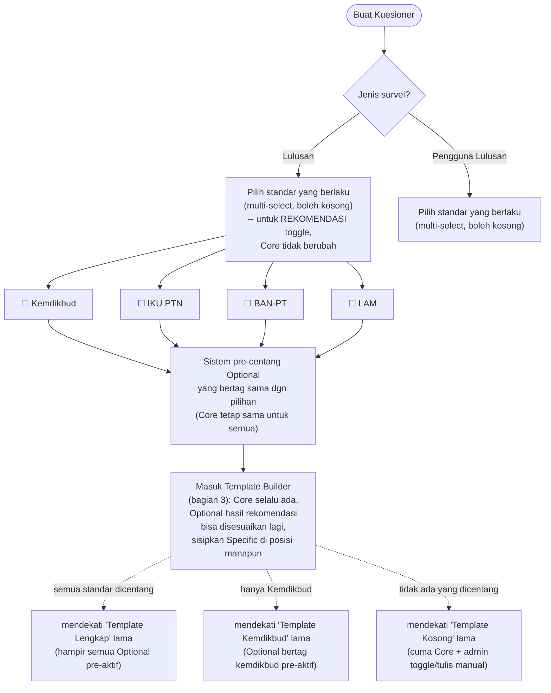

Catatan penting:

- **"Jenis survei" (Lulusan vs Pengguna Lulusan) tetap jadi fork di awal**, karena keduanya menyasar audiens berbeda (alumni vs perusahaan/user) dengan bank pertanyaan yang berbeda pula — ini bukan soal tier Core/Optional, tapi soal populasi target, jadi wajar tetap dipisah di langkah pertama.
- **Pemisahan "Lengkap / Kemdikbud / Kosong" melebur jadi satu langkah "pilih standar yang berlaku"** — tapi perannya berubah dari *menentukan Core* (draft awal, sudah dikoreksi) menjadi **pre-centang rekomendasi Optional** saja. Core selalu identik untuk semua institusi, apa pun yang dicentang di sini.
- Institusi yang butuh kombinasi di luar 4 pilihan lama (mis. Kemdikbud + IKU PTN saja) otomatis terfasilitasi tanpa perlu kartu tambahan — cukup centang dua standar tsb, lalu fine-tune toggle Optional secara manual di Template Builder.
- Kalau regulator baru muncul di masa depan, cukup tambah 1 checkbox baru + `regulator_tags` baru di bank Optional — tidak perlu bikin template/kartu baru, dan tidak perlu mengubah definisi Core.

# NEW CASE & LOGIC

## 9. Angkatan (Cohort), Irisan Antar-Tahun, & Kasus Status/Pekerjaan Ganda

> **Asumsi yang dipakai di seluruh bagian ini:** "Angkatan" = **tahun lulus** (graduation cohort), bukan tahun masuk — karena semua perhitungan gelombang survei (Exit / GS-I / GS-II) diukur dari tanggal kelulusan, sesuai kerangka Schomburg (slide 27, 31). Kalau di KarirLink "angkatan" selama ini berarti tahun masuk, strukturnya tetap sama, tinggal ganti field acuannya — tapi ini perlu dikonfirmasi ke tim produk sebelum diimplementasi.

### 9.1 Estimasi Waktu Setiap Gelombang (Core Timing)

| Gelombang | Offset dari Tahun Lulus | Karakteristik (Schomburg slide 27, 31) |
|---|---|---|
| **Exit Survey** | tahun ke-0 (saat lulus) | Jarang dilakukan ("seldom"), sekali di titik lulus, fokus data yang cuma bisa diambil saat itu (kompetensi akhir, alamat kontak) |
| **Graduate Survey I** | **> 1 tahun**, tepatnya tahun ke-1 s.d. ke-2 | Paling sering dilakukan ("most frequent"), fokus transisi ke dunia kerja |
| **Graduate Survey II** | **> 4 tahun**, tepatnya tahun ke-4 s.d. ke-5 | Lebih jarang ("less frequent"), fokus keberhasilan karier jangka panjang |

Formula: `tahun_kalender_wave = tahun_lulus + offset`. Karena tiap gelombang punya rentang **2 tahun kalender** (bukan 1 titik), satu angkatan tetap berada di gelombang yang sama selama 2 tahun berturut-turut.

### 9.2 Irisan Antar Angkatan — Ya, Ada, dan Ini Normal

Dengan rumus di atas, angkatan 2024–2028 menghasilkan jadwal berikut (disederhanakan, GS-I/GS-II ditulis per tahun kalender aktifnya):

| Tahun Kalender | Yang Sedang Berjalan |
|---|---|
| 2024 | Angkatan 2024 → **Exit** |
| 2025 | Angkatan 2024 → **GS-I** (th. ke-1) · Angkatan 2025 → **Exit** |
| 2026 | Angkatan 2024 → **GS-I** (th. ke-2) · Angkatan 2025 → **GS-I** (th. ke-1) · Angkatan 2026 → **Exit** |
| 2027 | Angkatan 2025 → **GS-I** (th. ke-2) · Angkatan 2026 → **GS-I** (th. ke-1) · Angkatan 2027 → **Exit** |
| **2028** | Angkatan 2024 → **GS-II** (th. ke-1) · Angkatan 2026 → **GS-I** (th. ke-2) · Angkatan 2027 → **GS-I** (th. ke-1) · Angkatan 2028 → **Exit** |
| 2029 | Angkatan 2024 → **GS-II** (th. ke-2) · Angkatan 2025 → **GS-II** (th. ke-1) · Angkatan 2027 → **GS-I** (th. ke-2) · Angkatan 2028 → **GS-I** (th. ke-1) |
| 2030 | Angkatan 2025 → **GS-II** (th. ke-2) · Angkatan 2026 → **GS-II** (th. ke-1) · Angkatan 2028 → **GS-I** (th. ke-2) |
| 2031 | Angkatan 2026 → **GS-II** (th. ke-2) · Angkatan 2027 → **GS-II** (th. ke-1) |
| 2032 | Angkatan 2027 → **GS-II** (th. ke-2) · Angkatan 2028 → **GS-II** (th. ke-1) |
| 2033 | Angkatan 2028 → **GS-II** (th. ke-2) |

**Jawaban singkat: ya, ada irisan — bahkan ini kondisi normal/steady-state, bukan edge case.** Puncaknya di tahun 2028: **4 campaign berjalan bersamaan** untuk 4 angkatan berbeda dengan 3 wave berbeda (GS-II, GS-I×2, Exit). Implikasinya ke sistem: platform **tidak boleh mengasumsikan "satu template aktif per institusi per waktu"** — yang benar adalah beberapa `SURVEY_CAMPAIGN` aktif paralel, masing-masing terikat ke kombinasi (angkatan, wave, template_version) sendiri-sendiri.

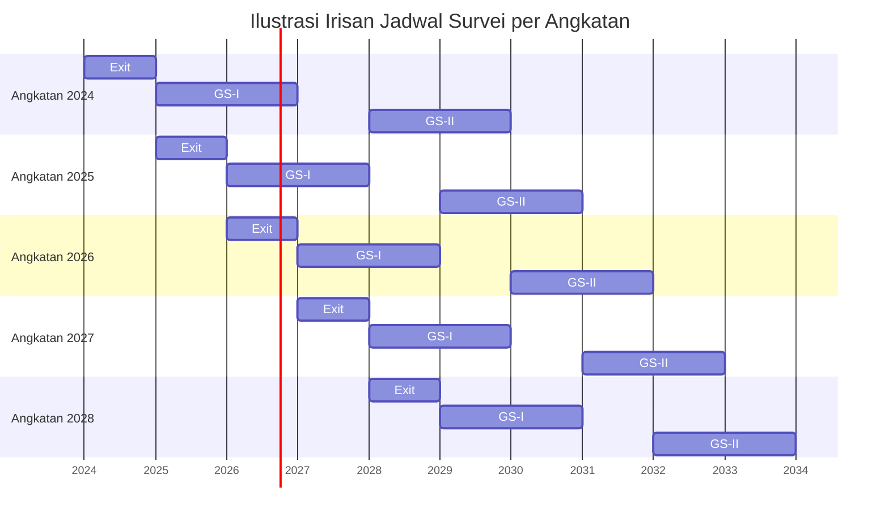

### 9.3 Contoh Pertanyaan per Gelombang (Exit, GS-I, GS-II)

Menerjemahkan model di atas jadi daftar pertanyaan konkret per gelombang, memakai `variable_code` yang sama dengan [Pemetaan Pertanyaan Core vs Optional](Pemetaan%20Pertanyaan%20Core%20vs%20Optional%20(Draft%20Seed%20Data).md) supaya konsisten. Pemetaan waktu mengikuti kerangka Schomburg (slide 26, 29-30): sosiodemografi & kompetensi-saat-lulus di Exit; transisi kerja & pekerjaan pertama di GS-I; keberhasilan karier jangka panjang di GS-II.

**Dua logic interaktif berikut muncul berulang di GS-I *dan* GS-II** (bukan cuma sekali) — ditandai eksplisit di kolom "Catatan Interaktif" tiap tabel, detail mekanismenya ada di bagian 9.6:

- **Status ganda** — `STATUS_SAAT_INI` selalu **multi-select**; kalau responden centang >1, wajib isi `STATUS_UTAMA` (single-select) untuk klasifikasi headline/pelaporan nasional.
- **Pekerjaan ganda** — begitu `STATUS_SAAT_INI` mengandung "bekerja"/"wiraswasta", muncul `JUMLAH_PEKERJAAN` lalu grup **repeatable** `PEKERJAAN_GROUP` (1 entry per tempat kerja).

Penting: `STATUS_SAAT_INI` dan `PEKERJAAN_GROUP` adalah **baris `QUESTION` yang sama** dipakai ulang di GS-I maupun GS-II (bukan diduplikasi) — supaya datanya bisa dibandingkan antar-waktu untuk 1 lulusan (analisis panel, bagian 4).

#### 9.3.1 EXIT SURVEY (saat lulus)

| Pertanyaan | Variable Code | Tier | Catatan |
|---|---|---|---|
| Jenis kelamin, tanggal lahir | `SOSIODEMOGRAFI_DASAR` | Core | Baseline, sekali seumur hidup lulusan |
| Pendidikan orang tua | `PENDIDIKAN_ORTU` | Optional | tag: enrichment |
| Sebutkan sumber dana pembiayaan kuliah | `SUMBER_DANA_KULIAH` (Q2) | Optional | tag: kemdikbud |
| Tingkat kompetensi yang dikuasai saat lulus (bagian A) | `KOMPETENSI_A_B` (Q3, bagian **A** saja) | Core | Bagian B (dibutuhkan pekerjaan) belum relevan — menyusul di GS-I |
| Penekanan metode pembelajaran di prodi | `METODE_PEMBELAJARAN` (Q4) | Core | |
| Alamat & kontak lanjutan (email pribadi, No. HP, medsos) | `KONTAK_LANJUTAN` | Core | Krusial untuk GS-I/GS-II — dikumpulkan sedini mungkin (Schomburg slide 31) |
| Rencana Anda setelah lulus | `RENCANA_SETELAH_LULUS` | Optional | Prediktif, bukan status final — untuk strategi kontak, bukan pelaporan |
| *(contoh Specific)* Minat bergabung Ikatan Alumni | `UNVX_ALUMNI_INTEREST` | Specific | Ilustratif, lihat Pemetaan bagian 7.2 |

#### 9.3.2 GRADUATE SURVEY I (>1 tahun — transisi kerja)

| Pertanyaan | Variable Code | Tier | Catatan Interaktif |
|---|---|---|---|
| Status Anda saat ini? | `STATUS_SAAT_INI` (Q1) | Core | **MULTI-SELECT** — gate question, lihat 9.6 |
| Kalau pilih >1, mana status utama Anda? | `STATUS_UTAMA` | Core | Wajib diisi hanya kalau `STATUS_SAAT_INI` >1 nilai |
| Kapan mulai mencari pekerjaan? | `MULAI_CARI_KERJA` (Q5) | Optional | tag kemdikbud; `depends_on`: status mengandung bekerja/mencari kerja |
| Bagaimana cara mencari pekerjaan? | `CARA_CARI_KERJA` (Q6) | Optional | tag kemdikbud |
| Berapa perusahaan yang sudah dilamar? | `JUMLAH_LAMARAN` (Q7) | Optional | tag kemdikbud |
| Berapa yang merespons lamaran? | `JUMLAH_RESPON_LAMARAN` (Q8) | Optional | tag kemdikbud |
| Berapa yang mengundang wawancara? | `JUMLAH_WAWANCARA` (Q9) | Optional | tag kemdikbud |
| Aktif mencari kerja 4 minggu terakhir? | `AKTIF_CARI_KERJA_4MGG` (Q10) | Optional | tag kemdikbud |
| Berapa tempat kerja yang dijalani saat ini? | `JUMLAH_PEKERJAAN` | Core | Gate untuk grup repeatable di bawah; `depends_on`: status mengandung bekerja/wiraswasta |
| Instansi / bidang kerja / status kerja / gaji *(per tempat kerja)* | `PEKERJAAN_GROUP` | Core | **REPEATABLE** — 1 entry per pekerjaan, jumlah entry mengikuti `JUMLAH_PEKERJAAN` |
| Tingkat kompetensi yang dibutuhkan pekerjaan saat ini (bagian B) | `KOMPETENSI_A_B` (Q3, bagian **B**) | Core | Melengkapi bagian A yang sudah dijawab di Exit |
| Jika pekerjaan tidak sesuai pendidikan, kenapa diambil? | `ALASAN_KERJA_TDK_SESUAI` (Q11) | Optional | `depends_on`: kesesuaian kerja = tidak sesuai |
| Jenjang studi lanjut (kalau ada) | `JENJANG_STUDI_LANJUT` | Optional | `depends_on`: status mengandung melanjutkan pendidikan |
| Bidang usaha (kalau wirausaha) | `BIDANG_USAHA` | Optional | `depends_on`: status mengandung wiraswasta |
| Gaji pertama, waktu tunggu, skala instansi, lokasi kerja | *(gap, belum ada kode resmi)* | Optional — perlu verifikasi | Lihat Pemetaan bagian 3 |

#### 9.3.3 GRADUATE SURVEY II (>4 tahun — keberhasilan karier jangka panjang)

| Pertanyaan | Variable Code | Tier | Catatan Interaktif |
|---|---|---|---|
| Status Anda saat ini? *(diukur ulang)* | `STATUS_SAAT_INI` | Core | **MULTI-SELECT** lagi — baris pertanyaan sama dengan GS-I, status bisa berubah dibanding sebelumnya |
| Status utama (kalau >1) | `STATUS_UTAMA` | Core | Sama pola dengan GS-I |
| Berapa tempat kerja yang dijalani saat ini? | `JUMLAH_PEKERJAAN` | Core | Repeatable lagi — jumlahnya bisa naik/turun dibanding GS-I |
| Instansi / bidang kerja / gaji *(per tempat kerja saat ini)* | `PEKERJAAN_GROUP` | Core | **REPEATABLE**, pola sama dengan GS-I |
| Tingkat kompetensi yang dibutuhkan pekerjaan saat ini (bagian B, diukur ulang) | `KOMPETENSI_A_B` (Q3, bagian B) | Core | Untuk melihat tren perubahan sejak GS-I |
| Seberapa besar pekerjaan sesuai bidang pendidikan? *(persepsi)* | *(enrichment)* | Optional | Indikator subjektif Schomburg — lihat Pemetaan bagian 4 |
| Seberapa besar kompetensi kuliah dimanfaatkan dalam pekerjaan? | *(enrichment)* | Optional | idem |
| Bagaimana Anda menilai status pekerjaan saat ini? | *(enrichment)* | Optional | idem |
| Seberapa besar otonomi/kebebasan dalam pekerjaan? | *(enrichment)* | Optional | idem |
| Seberapa puas dengan pekerjaan saat ini secara keseluruhan? | *(enrichment)* | Optional | idem |
| Faktor konteks: kondisi sektor/industri tempat bekerja | *(gap, belum ada kode resmi)* | Optional — perlu verifikasi | Lihat Pemetaan bagian 3 |
| Saran perbaikan program studi/kurikulum | `SARAN_PERBAIKAN_PRODI` | Optional | Feedback loop ke institusi — sering diminta BAN-PT/LAM |

### 9.4 Bagaimana Admin Mengisi Angkatan & Relasi ke User/Institusi/Prodi

Poin paling penting: **admin tidak mengetik "angkatan" per pertanyaan atau per respons.** Angkatan adalah atribut milik data lulusan itu sendiri, diisi **sekali** saat data lulusan masuk ke sistem — biasanya lewat bulk-import dari PDDIKTI/SIAKAD (kolom: NIM, Nama, Prodi, Tahun Lulus), bukan diisi manual satu-satu tiap kali ada survei baru.

Yang admin lakukan justru di level **campaign**, bukan di level jawaban:

1. Sistem (scheduler) menghitung otomatis: "angkatan mana yang seharusnya masuk wave apa tahun ini?" — pakai formula 9.1.
2. Admin **mengonfirmasi/menyesuaikan** usulan itu (tanggal buka-tutup, `template_version` yang dipakai) lalu publish sebagai `SURVEY_CAMPAIGN` baru.
3. Sistem otomatis menarik daftar lulusan yang berhak ikut campaign tsb: `institution_id` + `program_studi_id` (kalau discope per prodi) + `cohort_year` yang cocok.
4. Tiap `RESPONSE` yang masuk terikat ke `campaign_id` (bukan ke `template_version_id` secara langsung) — angkatan si responden otomatis ikut terbawa lewat relasi `respondent_id → cohort_year`, tanpa perlu disimpan ulang di tiap baris jawaban.

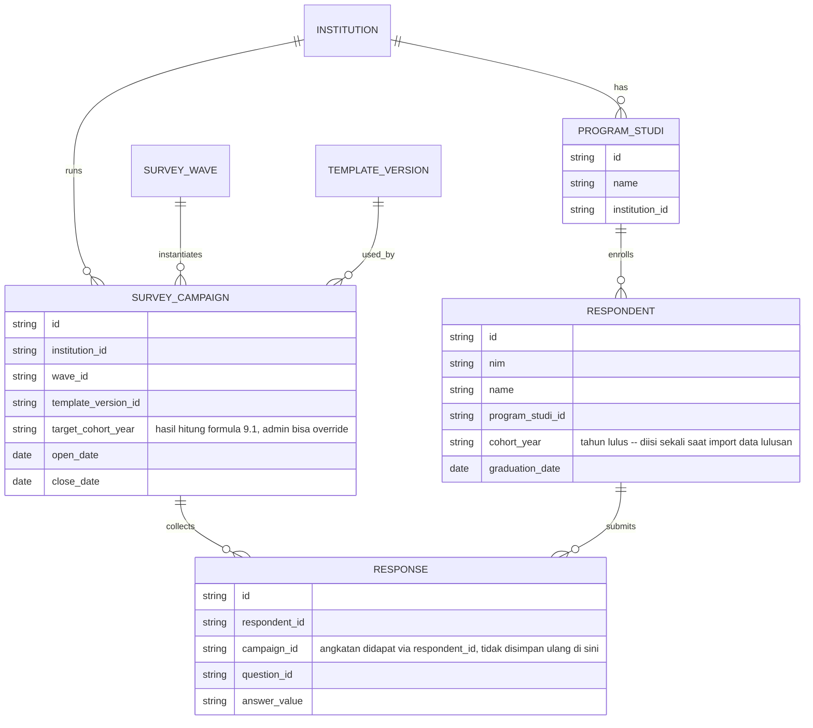

Relasi singkatnya: **Institusi → Prodi → Lulusan (bawa `cohort_year`) → Response**, disilangkan dengan **Institusi → Campaign (bawa `wave` + `target_cohort_year` + `template_version`) → Response**. Laporan "berapa lulusan Prodi X angkatan 2025 yang sudah kerja" tinggal join `RESPONSE → RESPONDENT (cohort_year, program_studi_id)` tanpa peduli campaign mana yang menghasilkannya.

### 9.5 Alur Penentuan Wave & Irisan (Treeflow)

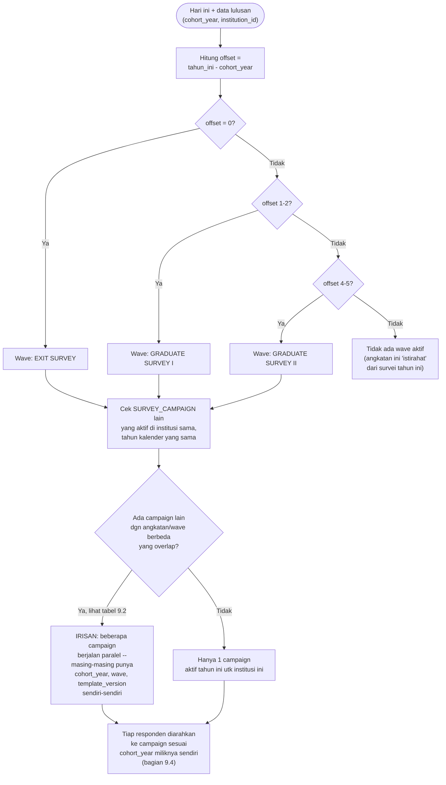

### 9.6 Kasus Status & Pekerjaan Ganda

Dua kasus yang ditanyakan butuh perlakuan berbeda karena sifatnya beda:

- **Status ganda** (mis. Wiraswasta + Bekerja; Bekerja + Melanjutkan Studi) → soal *kategori mana saja yang berlaku* untuk responden itu. Solusinya: `Status Anda saat ini?` (Q1) diubah dari **single-select** jadi **multi-select** (centang semua yang berlaku), ditambah satu pertanyaan pendamping **`status_utama`** (wajib single-select) khusus untuk klasifikasi headline/pelaporan nasional (IKU PTN dkk. butuh 1 kategori pasti per lulusan, tidak bisa "keduanya").
- **Pekerjaan ganda** (mis. kerja di 2 tempat bersamaan) → soal *berapa kali instance dari pertanyaan yang sama harus diulang*. Solusinya: kelompok pertanyaan "Pekerjaan" ditandai `repeatable: true` — responden bisa menekan "+ Tambah pekerjaan lain", tiap entry (pekerjaan #1, #2, dst) punya jawaban sendiri-sendiri untuk sub-pertanyaan yang sama (instansi, bidang kerja, gaji, dst).

Perluasan skema (di luar yang sudah ada di 6.1):

```
QUESTION {
  ...                    // field lain sama seperti 2.1 / 6.1
  is_multi_select        // true khusus utk Q1 status
  repeatable             // true khusus utk grup pertanyaan spt "Pekerjaan"
}

RESPONSE_GROUP {          // representasi 1 "entry" dari grup repeatable
  id
  respondent_id
  question_group_id       // mis. "PEKERJAAN"
  entry_index             // 1, 2, 3, ... — urutan entry
}

RESPONSE {
  ...
  response_group_id       // null utk pertanyaan biasa; diisi kalau bagian dari repeatable group
}
```

Percabangan (`depends_on`) juga berubah dari "cocokkan 1 nilai" jadi "cocokkan salah satu/irisan dari himpunan nilai" — kalau Q1 dijawab `["bekerja", "melanjutkan_pendidikan"]`, **kedua** section (Pekerjaan **dan** Studi Lanjut) tampil sekaligus, bukan pilih salah satu.

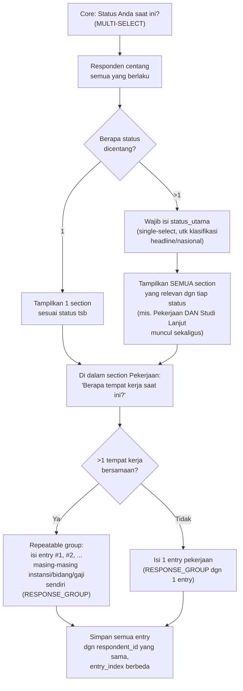

### 9.7 Contoh Hasil Data untuk Kasus Ganda

Skenario: **Budi**, angkatan 2025, sedang bekerja penuh waktu di satu instansi sambil *freelance* di tempat lain, dan bersamaan itu juga sedang melanjutkan S2:

```json
{
  "respondent_id": "R-2026-00456",
  "campaign_id": "CMP-UNVX-2026-COHORT2025-GSI",
  "responses": [
    { "question_id": "Q1",      "variable_code": "STATUS_SAAT_INI", "tier": "core", "status": "answered",
      "value": ["bekerja", "melanjutkan_pendidikan"] },
    { "question_id": "Q1_UTAMA","variable_code": "STATUS_UTAMA",    "tier": "core", "status": "answered",
      "value": "bekerja" },
    { "question_id": "PEKERJAAN", "variable_code": "PEKERJAAN_GROUP", "tier": "core", "status": "answered", "repeatable": true,
      "value": [
        { "entry_index": 1, "instansi": "PT Alpha",        "bidang": "IT",     "status_kerja": "full_time", "gaji": 6000000 },
        { "entry_index": 2, "instansi": "Freelance Desain", "bidang": "Kreatif","status_kerja": "part_time", "gaji": 1500000 }
      ]
    },
    { "question_id": "Q_STUDI_LANJUT", "variable_code": "JENJANG_STUDI_LANJUT", "tier": "optional", "status": "answered",
      "value": "S2" }
  ]
}
```

Implikasi ke pelaporan: **National Monitor** (agregasi lintas institusi) memakai `STATUS_UTAMA` (nilai tunggal) supaya tiap lulusan tetap masuk 1 kategori pasti sesuai definisi IKU PTN dkk. **Dashboard internal institusi** bisa memakai `STATUS_SAAT_INI` (array penuh) + `PEKERJAAN_GROUP` (array entry) untuk analisis lebih kaya, mis. "berapa persen lulusan kami punya lebih dari 1 pekerjaan sekaligus" — insight yang hilang kalau cuma mengandalkan `status_utama`.
