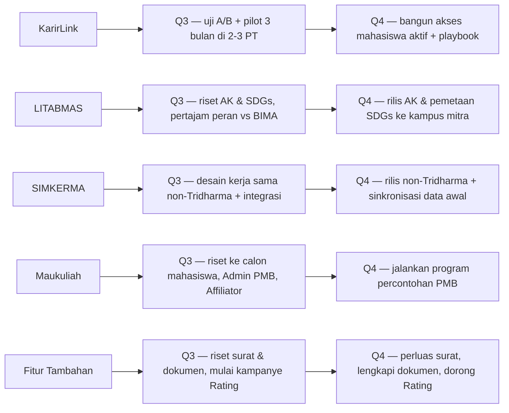
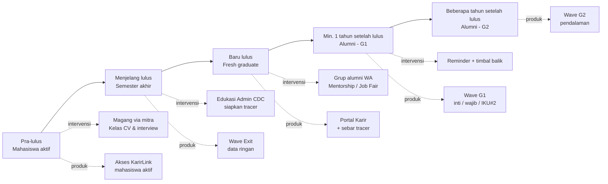

# Workplan Q3–Q4 2026 — Squad Foxtrot

> Rencana ini disusun mengikuti arahan manajemen: berangkat dari **dampak nyata bagi pengguna** dan ukuran keberhasilan yang jelas — bukan dari daftar fitur atau jadwal sprint.
> **Cakupan:** Maukuliah, SIMKERMA, LITABMAS, KarirLink, serta Fitur Persuratan, Custom Report v2, dan Rating.
> **Status:** Draft. Empat modul utama dan tiga fitur tambahan sudah dirumuskan; sebagian baseline (fitur tambahan) dan konteks Maukuliah masih perlu dilengkapi.
> **Dibuat:** 21 Juli 2026 · Granularitas waktu di dokumen ini sengaja dijaga pada level kuartal (Q3/Q4); detail tanggal dan penanggung jawab hidup di JIRA.

---

## 1. Ringkasan Squad

Cara termudah memahami pekerjaan Foxtrot bukanlah lewat daftar produk, melainkan dengan mengikuti perjalanan sebuah kampus. Semuanya bermula ketika seorang calon mahasiswa mencari tempat kuliah — di sanalah **Maukuliah** bekerja. Setelah ia diterima dan menempuh studi hingga lulus, **KarirLink** menemaninya menuju dunia kerja dan merekam jejak kariernya. Sepanjang itu, para dosen menghasilkan penelitian dan pengabdian yang dicatat oleh **LITABMAS**, sementara setiap kerja sama yang terjalin kampus — dengan perusahaan, instansi, maupun kampus lain — dirangkum oleh **SIMKERMA**.

Empat modul itu tampak berbeda, tetapi sebenarnya menopang satu perjalanan yang sama dan bermuara pada hal yang hari ini paling dipedulikan setiap kampus: **capaian IKU**. Karena itulah rencana ini kami tulis berdasarkan dampak, bukan fitur — agar jelas perubahan apa yang benar-benar dirasakan kampus, dan bagaimana kita membuktikannya dengan angka.

### 1.1 Benang merah

> **Modul-modul Foxtrot saling menyuapi data untuk mendorong capaian IKU Perguruan Tinggi.**

- **KarirLink** membantu kampus memenuhi **IKU#2** — lulusan yang bekerja, berwirausaha, atau melanjutkan studi (termasuk yang sudah bekerja dan berwirausaha sebelum lulus).
- **LITABMAS** mendukung **IKU#5 & IKU#7** serta pencatatan **Angka Kredit** penelitian dosen.
- **SIMKERMA** menjadi simpul yang menghimpun seluruh kerja sama — termasuk yang lahir di LITABMAS dan KarirLink.
- **Maukuliah** menjaga hulu funnel: menjaring dan mengonversi calon mahasiswa.
- **Fitur tambahan** menopang operasional dan umpan balik: **Persuratan** (layanan surat), **Custom Report v2** (dokumen resmi), dan **Rating** (feedback loop lintas modul).

Satu prinsip mengikat semuanya: **setiap modul divalidasi lewat piloting sebelum diskalakan** — dan piloting di sini bisa berupa intervensi program, bukan sekadar membangun fitur.

### 1.2 Product Roadmap

Roadmap ini sengaja disajikan pada level kuartal, bukan tanggal harian — cukup untuk menunjukkan kira-kira kapan sesuatu dikerjakan dan hasil apa yang diharapkan. Setiap baris mewakili satu modul; dibaca dari kiri ke kanan, ia menunjukkan perkembangan dari Q3 ke Q4. Rincian per modul dapat dilihat pada tabel di bagian 1.3.

### 1.3 Ringkasan per modul: dari kondisi saat ini ke target 2026

| Modul | Kondisi saat ini | Target akhir 2026 | Cara mencapai |
|---|---|---|---|
| **KarirLink** | Admin CDC harus menyusun ulang kuesioner tracer study tiap angkatan (melelahkan), dan banyak alumni enggan mengisi. Baru 27,7% kampus mencapai target pengisian tracer ≥30%. | One living questionnaire yang ringan dikelola dan bisa diakses sesuai milestone mahasiswa/alumni; kampus terbantu sehingga pengisian tracer naik ke 35% dan data IKU#2 lebih lengkap. | Membandingkan dua pendekatan — model lama vs usulan "one living questionnaire" — lalu memilih yang terbukti lebih baik untuk dijadikan standar; menjalankan program percontohan di beberapa kampus (magang, kelas karier) agar alumni lebih rela mengisi. |
| **LITABMAS** | Nyaris tak terpakai (adopsi <1%) karena fungsinya beririsan dengan aplikasi pemerintah (BIMA). Baru 3 kampus punya luaran penelitian tercatat. | Peran LITABMAS jelas berbeda dari BIMA — fokus mencatat aktivitas penelitian dosen untuk Angka Kredit & pelaporan IKU. Luaran tercatat naik ke 8–10 kampus. | Riset ke 3–5 kampus untuk memastikan kebutuhan, lalu membangun fitur pencatatan Angka Kredit dan pemetaan kegiatan ke SDGs. |
| **SIMKERMA** | Sudah cukup sehat (44 kampus, adopsi 26%), tetapi hanya menampung kerja sama Tridharma dan datanya diinput terpisah dari modul lain. | Menjadi pusat seluruh kerja sama kampus — termasuk non-Tridharma seperti pelatihan ke instansi — dan menerima data dari LITABMAS & KarirLink. Adopsi naik ke 55–60 kampus. | Menambah jenis kerja sama non-Tridharma, merancang aliran data dari modul lain, dan mengoptimalkan fitur impor data. |
| **Maukuliah** | Pengguna tumbuh, tetapi hanya ~15% yang lanjut mendaftar dan angkanya datar. Kebutuhan penggunanya belum cukup dipahami. | Memahami kebutuhan calon mahasiswa, Admin PMB, dan Affiliator, lalu menjalankan program percontohan PMB yang memperbaiki konversi. | Wawancara + survei ke ketiga pihak tersebut, lalu menjalankan program percontohan berdasarkan temuannya. |
| **Persuratan** | Baru melayani satu jenis surat (Keterangan Aktif Mahasiswa). | Melayani lebih banyak jenis surat (pengajuan maupun penerbitan) untuk mahasiswa dan dosen. | Riset ke BAAK, mahasiswa, dan dosen untuk memetakan kebutuhan, lalu memperluas jenis surat. |
| **Custom Report v2** | Menangani dokumen resmi (Ijazah, SKPI, Transkrip, KTM), tetapi kebutuhan isinya belum tergali lengkap. | Dokumen bisa dibuat otomatis dengan isi dan gaya yang dapat disesuaikan tiap kampus. | Riset kebutuhan isi tiap dokumen, lalu melengkapi mesin variabel dan opsi kustomisasi. |
| **Rating** | Fitur pada dasarnya siap, tetapi masih butuh sedikit penyempurnaan (feedback Tech Lead) dan belum rilis. | Diisi secara luas sehingga umpan baliknya dapat memandu perbaikan produk. | Selesaikan penyempurnaan kecil, lalu kampanye adopsi agar kampus rutin mengisi (mulai dari modul dasar). |

---
## 2. KarirLink

Bayangkan seorang Admin CDC di sebuah kampus. Setiap periode ia harus menyusun kuesioner tracer study dari awal, memfinalisasinya, lalu mengirimkannya berulang kali untuk tiap angkatan — pekerjaan yang menyita waktu dan melelahkan. Di seberang sana, ribuan alumni sudah tersebar ke berbagai kota dan sebagian besar enggan mengisi kuesioner, karena merasa tak lagi punya keterikatan dengan almamaternya. Dua persoalan inilah — **beban Admin CDC** dan **rendahnya keterlibatan alumni** — yang membuat data IKU#2 sulit lengkap dan tepat waktu.

Rencana KarirLink pada Q3–Q4 hendak mengurai keduanya sekaligus: menyederhanakan pekerjaan admin lewat satu kuesioner yang "hidup", dan membuat alumni mau mengisi karena mereka lebih dulu merasa terbantu oleh kampusnya.

### 2.1 Dampak yang dituju
Membantu kampus menangkap **data karier lulusan yang akurat dan tepat waktu (minimal satu tahun setelah lulus)** untuk mendorong **IKU#2**, sekaligus **memangkas beban Admin CDC** dalam menjalankan tracer study. Portal Karir berperan ganda: mesin yang menghasilkan data karier, sekaligus nilai jual yang menarik kampus untuk mengadopsi.

### 2.2 Kenapa desainnya seperti ini
Model tracer KarirLink tidak dikarang sendiri. Ia bersandar pada metodologi tracer study yang sudah mapan (Schomburg, INCHER-Kassel) dan menyambung langsung ke syarat regulasi IKU#2:

- Riset Schomburg menegaskan tracer yang baik diukur **berjenjang menurut waktu**, dalam tiga fase pengisian:
  - **Exit** — saat mahasiswa baru lulus; sekadar memperbarui data dasar dan kontak alumni (ringan).
  - **Graduate 1 (G1)** — satu tahun setelah lulus; berisi pertanyaan inti tentang status bekerja/berwirausaha/melanjutkan studi. **Inilah fase yang mengisi IKU#2.**
  - **Graduate 2 (G2)** — dua tahun atau lebih setelah lulus; menggali lebih dalam, misalnya seberapa relevan pekerjaan alumni dengan prodinya.

  Intinya, tiap pertanyaan diajukan pada momentum waktu menjawab paling tepat sesuai yang dirasakan oleh mahasiswa/alumni. Contohnya, menanyakan status pekerjaan tidak jauh setelah wisuda itu tidak tepat — karena kebanyakan alumni memang belum bekerja — sedangkan menanyakannya satu tahun kemudian (G1) menangkap gambaran status kerja yang sebenarnya. Riset ini juga memisahkan pertanyaan **inti yang terkunci** (Core — sesuai standar Kemdikti/Kemenkes, agar bisa dibandingkan antar-kampus dan secara nasional) dari pertanyaan pilihan institusi (Optional/Specific), serta mengingatkan pentingnya menjaga tingkat respons dari mahasiswa/alumni di setiap fase.
- Regulasi IKU#2 (Kepmen 358/2025) mewajibkan datanya diambil dari **tracer minimal satu tahun setelah mahasiswa lulus**, dengan responden minimum mengikuti rumus **Slovin galat 2,3%**.
- Titik temunya jelas: **fase G1 jatuh minimal satu tahun setelah lulus**, persis momen IKU#2 diukur. Maka model **Single & Living** — satu kuesioner hidup dengan fase Exit/G1/G2 dan tingkatan Core/Optional/Specific — bukan sekadar penyederhanaan, tetapi cara memastikan data IKU#2 terkumpul pada waktu dan mutu yang benar, sambil meringankan admin.

Metodologi di atas menjawab **sisi admin**: bagaimana kuesioner disusun dan kapan setiap pertanyaan ditanyakan. Tetapi ingat, di awal kita menyebut dua persoalan — beban admin *dan* rendahnya keterlibatan alumni. Menyederhanakan kuesioner belum tentu membuat alumni mau mengisinya. Di sinilah **sisi alumni** perlu dijawab, dan prinsip utamanya kami sebut **Timbal Balik**: beri nilai karier lebih dulu (magang, kelas karier, job fair, lowongan nyata), sehingga alumni merasa "berhutang budi" pada kampus dan lebih rela mengisi tracer. Ini cara menaikkan tingkat respons yang sesungguhnya — jauh lebih ampuh daripada sekadar memperbaiki tampilan formulir.

Beberapa prinsip lain juga kami kunci: fase (*wave*) dan tingkatan (*tier*) adalah dua hal terpisah; jawaban tiap fase dikunci demi keutuhan data IKU, sementara pembaruan mandiri hanya mengisi profil terkini tanpa menimpanya; dan setiap data selalu punya jejak asal-usul (sumber, waktu, aktor).

### 2.3 Ukuran keberhasilan

| Kode | Metrik | Baseline (Juni 2026) | Target Q4 2026 | Catatan |
|---|---|---|---|---|
| **A** | % PT yang capai adopsi tracer ≥30% | 27,7% (125/451) | **35%** | Metrik utama. **35% = target internal tim** (kenaikan ~7 poin dari baseline 27,7%, bukan angka regulasi). Digerakkan oleh replikasi playbook pasca-pilot, bukan pilot langsung |
| **B** | Portal Karir — pelamar / lamaran | 1.966 pelamar / 3.993 lamaran | Ditetapkan
| **C** | Kualitas data IKU#2 di G1 (Slovin 2,3%) | Belum terukur | Pilot: instrumen & pipeline siap · Riil: X PT capai Slovin di G1 | Angka riil hanya muncul dari siklus alumni yang >1 tahun setelah lulus sebenarnya, ini hanya untuk piloting 3 bulan jadi capaiannya nanti hanya sebatas untuk kesuksesan piloting dulu |

Satu hal penting untuk dicatat: metrik capaian ketika **pilot program** akan berbeda dari metrik **nasional** (target 35%). Pilot di beberapa kampus memvalidasi *playbook*-nya; angka nasional baru bergerak ketika playbook itu direplikasi ke banyak kampus, dan itu bisa melampaui Q4. Jadi keberhasilan pilot tidak semestinya dinilai dari angka nasional.

### 2.4 Piloting Program — inti gerakan Q3
Hipotesis yang kami uji sederhana: **kampus yang menjalankan intervensi karier akan memperoleh tingkat respons G1 yang lebih tinggi.**

Pilot dijalankan selama **tiga bulan**, dengan alur Exit→G1→G2 sengaja dipadatkan — tujuannya menguji alur dan mekanik, bukan menunggu siklus setahun yang sebenarnya. Cakupannya 2–3 kampus terpilih (kriteria: data SIAKAD rapi, Admin CDC aktif, sudah punya mitra perusahaan awal), dan penyusunan daftarnya dipegang **Desintya (Product Support)**. Agar keberhasilan bisa dibuktikan, baseline tiap kampus ditetapkan sejak awal, dan setiap kampus memilih menu intervensi sesuai kesanggupannya sehingga kita bisa melihat kombinasi yang paling berdampak.

### 2.5 Perjalanan yang kami coba bangun
Sebagai ilustrasi, ikuti perjalanan seorang mahasiswa — sebut saja Rani. Di semester akhir, ia menemukan lowongan magang lewat KarirLink dan diterima di sebuah perusahaan dengan gaji di atas 1,2× UMP — satu poin IKU#2 untuk kampusnya, bahkan sebelum ia lulus. Menjelang wisuda ia mengisi data ringan (Exit). Setahun kemudian kampus mengirim kuesioner inti (G1); karena selama ini merasa terbantu — memperoleh magang, ikut kelas CV, tetap terhubung lewat grup alumni — ia dengan senang hati mengisinya, dan di titik itulah data IKU#2 resmi tercatat. Setahun berikutnya (G2), kampus menggali lebih dalam relevansi prodi dengan pekerjaannya. Satu alur yang sama menopang tiga hal sekaligus: alumni terbantu, data IKU terkumpul tepat waktu, dan admin tak perlu membangun apa pun dari nol.

### 2.6 Strategi dan langkah per kuartal
Strategi KarirLink berjalan di dua jalur yang saling melengkapi. **Jalur produk** menuntaskan uji dua pendekatan — menjalankan A/B Testing untuk membandingkan model lama (banyak kuesioner) dengan usulan "satu kuesioner hidup", lalu memutuskan mana yang dipakai sebagai standar dan memperbarui PRD — membuka akses KarirLink bagi mahasiswa aktif (dengan catatan penting soal definisi "mahasiswa aktif", hak akses via SSO/SIAKAD, dan consent/PII), serta meletakkan fondasi ekosistem Portal Karir berupa mitra perusahaan terverifikasi — untuk Q3–Q4 realistisnya baru sampai konsep dan beberapa mitra jangkar, karena membangun ekosistem dua sisi memang butuh waktu. **Jalur program** menjalankan pilot 3 bulan dengan menu intervensinya dan mendokumentasikan success story menjadi playbook yang siap direplikasi.

| | Q3 2026 | Q4 2026 |
|---|---|---|
| **Produk** | Pendekatan terpilih dari uji A/B Testing → PRD final; desain akses mahasiswa aktif ke Karirlink (+ cek SSO/consent) | Bangun akses mahasiswa aktif + satu kuesioner hidup; optimalkan ekosistem Portal Karir + mitra perusahaan |
| **Program** | Pilot di beberapa PT (magang, kelas karier, edukasi Admin CDC); baseline terpasang | Success story terdokumentasi (before/after); playbook siap direplikasi |
| **Metrik** | Instrumentasi metrik C; baseline Portal Karir | A: 27,7% → 35% (via rollout); B: target dari hasil pilot; C: X PT capai Slovin di G1 |

---
## 3. LITABMAS

LITABMAS adalah modul yang paling tertinggal di antara kami: adopsinya di bawah 1% dan, dari Mei ke Juni, angkanya tidak bergerak sama sekali. Alih-alih menambal fitur, kami menelusuri Panduan Litabmas 2026 untuk mencari akar masalahnya — dan petunjuknya cukup jelas. Seluruh siklus pendanaan penelitian nasional sudah berjalan di aplikasi **BIMA** milik pemerintah. Selama LITABMAS terasa seperti "BIMA versi kampus", tidak ada alasan kuat bagi kampus untuk memakainya.

Justru di situ peluangnya. Ada banyak hal yang **tidak** dikerjakan BIMA namun **diwajibkan** kepada setiap kampus: mengelola siklus penelitian internal, menyusun Renstra, menyelaraskan indikator dengan IKU, dan menjalankan monev internal. Dan yang paling nyata diminta kampus saat ini adalah mengubah aktivitas penelitian dosen menjadi capaian yang benar-benar terhitung — untuk **Angka Kredit** dan pelaporan **IKU**, bahkan **Akreditasi**.

### 3.1 Dampak yang dituju
Membantu LPPM/kampus mengelola siklus penelitian dan pengabdian internal, serta **mengubah aktivitas dosen menjadi capaian yang terhitung** — untuk Angka Kredit dosen, pelaporan IKU (khususnya IKU#7 SDGs), dan kesiapan data akreditasi/klaster. Posisinya jelas: **lapisan internal yang melengkapi BIMA, bukan menggantinya.**

### 3.2 Posisi yang kami kunci
Panduan Litabmas 2026 (Bab 2.2) mewajibkan tiap kampus mengelola basis data penelitian/pengabdian, menyusun Renstra, menetapkan indikator yang selaras IKU, dan menjalankan monev internal — semuanya ranah internal kampus, bukan wilayah BIMA. Ditambah lagi, klasterisasi kampus dihitung dari SINTA dan akreditasi (dengan bobot Publikasi 25%), sehingga kampus — terutama PTS di klaster bawah — membutuhkan alat untuk merapikan capaiannya agar bisa naik klaster dan lolos skema pendanaan.

Soal integrasi teknis dengan BIMA (misalnya lewat API), kelayakannya belum diketahui dan **belum menjadi prioritas** — kami parkir dulu, bukan bagian dari target Q3–Q4.

### 3.3 Ukuran keberhasilan
Karena LITABMAS masih pada tahap penggalian, Q3–Q4 tidak mengejar angka adopsi besar, melainkan **memvalidasi titik masuk — yaitu fokus fitur yang paling dibutuhkan sebagai pembuka adopsi — dan mendapatkan kampus mitra pengembangan yang aktif**, dengan adopsi sebagai indikator awal.

| Kode | Metrik | Baseline (Juni 2026) | Target Q4 2026 | Catatan |
|---|---|---|---|---|
| **A** | PT aktif dengan luaran penelitian tercatat | 3 | **8–10** (bertahap) | Target dijaga konservatif karena LITABMAS masih di tahap awal penggalian |
| **B** | Kampus mitra pengembangan aktif memakai fitur AK & SDGs | 0 | **Widyatama + 1–2 PT** | Bukti bahwa titik masuk tervalidasi |
| **C** | Riset kebutuhan AK & SDGs terdokumentasi | Belum ada | **Selesai di 3–5 PT** | Fondasi keputusan build |

### 3.4 Strategi
Kami menggarap dua titik masuk sekaligus, karena keduanya sudah punya peminat. Yang pertama dan menjadi andalan, **pencatatan Angka Kredit Penelitian** — mencatat aktivitas penelitian dosen agar terhitung untuk kenaikan jabatan fungsional. Permintaannya sudah konkret dari **Universitas Widyatama**, dan nilainya ganda: membantu dosen naik jabatan sekaligus memperkuat komponen SDM di klasterisasi. Yang kedua, **pemetaan SDGs → IKU#7** — mengubah aktivitas riset dan pengabdian menjadi laporan kontribusi SDGs agar kampus lebih mudah melapor. Sasaran awal kami condong ke PTS klaster bawah yang paling membutuhkan, meski ini masih perlu dikonfirmasi lewat riset Q3.

| | Q3 2026 | Q4 2026 |
|---|---|---|
| **Produk/Desain** | Pertajam pembedaan peran vs BIMA; rancang pemetaan aktivitas → AK & SDGs/IKU#7 | Rilis pencatatan AK + pemetaan SDGs/IKU#7 untuk kampus mitra pengembangan |
| **Riset** | Riset kebutuhan AK & SDGs ke 3–5 PT (Widyatama sebagai kampus mitra) | Temuan dipakai untuk keputusan pembangunan fitur & rencana perluasan |
| **Metrik** | Riset selesai; positioning terkunci | A: 3 → 8–10; B: Widyatama + 1–2 PT aktif |

---

## 4. SIMKERMA

Berbeda dari LITABMAS, SIMKERMA justru modul yang paling sehat: adopsinya 26% dan tumbuh dari 39 ke 44 kampus dalam sebulan. Tapi perannya di dalam squad bisa jauh lebih besar. SIMKERMA seharusnya menjadi **hilir** dari setiap kerja sama yang lahir di modul lain — kolaborasi penelitian dari LITABMAS, kemitraan perusahaan dari KarirLink — sehingga kampus punya satu sumber kebenaran untuk seluruh kerja samanya.

Membaca Permendikbud No. 14/2014 juga menegaskan satu hal: kerja sama kampus **tidak terbatas pada Tridharma**. Ada seluruh ranah non-akademik — layanan pelatihan, pendayagunaan aset, event organizer, pemberdayaan masyarakat — yang selama ini belum tentu tertampung. Permintaan dari **STIA LAN Bandung** untuk mencatat pelatihan dosen kepada pegawai instansi adalah contoh nyata kebutuhan itu.

### 4.1 Dampak yang dituju
Menjadikan SIMKERMA **pusat pencatatan seluruh kerja sama kampus** — Tridharma maupun non-Tridharma — yang menghimpun aktivitas dari LITABMAS dan KarirLink, sehingga kampus memiliki satu sumber kebenaran untuk pelaporan (termasuk IKU#5 luaran kerja sama/hilirisasi) dan tata kelola.

### 4.2 Posisi yang kami kunci
Permendikbud 14/2014 membagi kerja sama kampus ke dalam dua ranah: **akademik** (pendidikan, penelitian, pengabdian, penjaminan mutu, dsb.) dan **non-akademik** (pendayagunaan aset, penggalangan dana, jasa/royalti HKI, layanan pelatihan, event organizer, pemberdayaan masyarakat, bursa tenaga kerja). Inilah landasan untuk memperluas SIMKERMA melampaui Tridharma. Peraturan yang sama juga mengatur atribut minimal perjanjian kerja sama (para pihak, ruang lingkup, hak/kewajiban, jangka waktu, HKI/aset negara, penyelesaian sengketa) — yang bisa kita jadikan standar kelengkapan data, dan itu bernilai untuk audit maupun akreditasi.

### 4.3 Ukuran keberhasilan
Karena sudah sehat dan tumbuh, wajar menetapkan target pertumbuhan yang nyata, ditambah ukuran untuk kapabilitas baru.

| Kode | Metrik | Baseline (Juni 2026) | Target Q4 2026 | Catatan |
|---|---|---|---|---|
| **A** | PT aktif dengan data kerja sama | 44 (adopsi 26%) | **55–60** (≈33–36%) | Melanjutkan tren pertumbuhan secara wajar |
| **B** | Kerja sama non-Tridharma tercatat | 0 | **Tersedia + dipakai** (a.l. STIA LAN) | Menutup celah taksonomi Permendikbud 14/2014 |
| **C** | Kerja sama tersinkron dari LITABMAS/KarirLink | 0 | **Desain Q3 → sync tahap awal Q4** | Mewujudkan peran hilir; hindari input ganda |

### 4.4 Strategi
Tiga langkah utama. Pertama, **memperluas taksonomi bentuk kegiatan kerja sama** mengacu Permendikbud 14/2014 — mencakup akademik dan non-akademik, memenuhi permintaan STIA LAN, dan dirancang agar bentuk kegiatan bisa dikonfigurasi sehingga jenis baru tak perlu mengubah kode. Kedua, **menjadikan SIMKERMA hilir** dengan menghimpun aktivitas kerja sama dari LITABMAS dan KarirLink agar tidak ada input ganda. Ketiga, **mengoptimalkan fitur Import** untuk memudahkan migrasi data lama, sekaligus menstandarkan kelengkapan perjanjian sebagai fondasi pelaporan IKU#5 dan akreditasi.

| | Q3 2026 | Q4 2026 |
|---|---|---|
| **Produk/Desain** | Desain taksonomi non-Tridharma (STIA LAN); rancang integrasi dari LITABMAS/KarirLink; optimalisasi Import | Rilis bentuk kegiatan non-Tridharma; sync tahap awal LITABMAS/KarirLink → SIMKERMA |
| **Metrik** | Desain integrasi & taksonomi siap | A: 44 → 55–60; B: non-Tridharma dipakai; C: sync tahap awal aktif |

---
## 5. Maukuliah

Di antara semua modul, Maukuliah berada paling hulu — dan paling awal perjalanannya. Penggunanya tumbuh (dari 3.786 ke 4.073) dan tes potensi naik cukup baik, tetapi hanya sekitar 15% pengguna yang berlanjut menjadi pendaftar, dan angka itu cenderung datar. Yang paling kurang saat ini bukanlah fitur, melainkan **pemahaman**: kami belum cukup menggali kebutuhan tiga pihak yang paling menentukan keberhasilan PMB — **calon mahasiswa**, **Admin PMB**, dan **Affiliator**. Tanpa mendengar mereka, perbaikan apa pun hanya menebak. Karena itu Q3–Q4 Maukuliah kami dedikasikan untuk mendengarkan dulu, lalu menjalankan piloting program PMB berdasarkan temuannya.

### 5.1 Dampak yang dituju
Membantu calon mahasiswa menemukan dan mendaftar ke kampus yang tepat, serta membantu Admin PMB dan Affiliator menjaring pendaftar berkualitas — dimulai dari memahami kebutuhan ketiganya, lalu mengubahnya menjadi piloting program PMB yang memperbaiki konversi.

> Sebagian konteks dan data Maukuliah berada di luar repository ini; bagian ini perlu dilengkapi dengan sumber tersebut saat tersedia.

### 5.2 Ukuran keberhasilan
Sebagai modul paling hulu dan paling perlu riset, Q3–Q4 tidak mengejar lonjakan angka, melainkan **menuntaskan riset dan menjalankan pilot**, dengan konversi funnel sebagai indikator awal.

| Kode | Metrik | Baseline (Juni 2026) | Target Q4 2026 | Catatan |
|---|---|---|---|---|
| **A** | Riset PMB (interview 3 persona + survei) | Belum ada | **Selesai + insight terdokumentasi** | Fondasi pilot |
| **B** | Piloting program PMB berjalan | 0 | **Jalan di PT/segmen terpilih** | Implementasi insight |
| **C** | Konversi pengguna → pendaftaran | ~15% | **Ditetapkan pasca-riset/pilot** | Angka target ditetapkan setelah pilot agar berbasis data nyata, bukan asumsi |

### 5.3 Strategi
Q3 adalah waktu mendengar: wawancara dan survei ke tiga persona — calon mahasiswa (motivasi memilih kampus dan hambatan mendaftar), Admin PMB (kebutuhan penjaringan dan pengelolaan funnel), serta Affiliator (skema insentif dan hambatan konversi). Q4 adalah waktu bertindak: mengubah insight itu menjadi intervensi yang terukur dan menjalankan piloting program PMB di kampus atau segmen terpilih.

---

## 6. Fitur Tambahan: Persuratan, Custom Report v2, dan Rating

Selain empat modul utama, Foxtrot memegang tiga fitur dengan karakter berbeda. Persuratan dan Custom Report v2 masih perlu penggalian kebutuhan, sedangkan Rating pada dasarnya sudah siap namun masih butuh sedikit penyempurnaan sebelum rilis dan didorong adopsinya. Baseline metrik ketiganya belum tersedia pada sesi ini dan ditandai untuk dilengkapi.

### 6.1 Persuratan
Persuratan membantu Admin PT (BAAK) melayani kebutuhan surat mahasiswa dan dosen. Saat ini baru satu jenis yang difasilitasi — Surat Keterangan Aktif Mahasiswa, sebatas *pengajuan*. Ke depan, repositori surat diharapkan berkembang tidak hanya untuk jenis pengajuan, tetapi juga penerbitan, dan mencakup surat mahasiswa maupun dosen. Fase ini *discovery-led*: Q3 diisi riset ke BAAK, mahasiswa, dan dosen untuk memetakan jenis surat yang paling dibutuhkan; Q4 memperluas jenis surat berdasarkan temuan. Ukurannya (baseline masih dilengkapi): riset selesai, jumlah jenis surat naik dari 1 menjadi beberapa, dan adopsi pemakaian mulai terukur.

### 6.2 Custom Report v2
Custom Report v2 menangani dokumen resmi seperti Ijazah, SKPI, Transkrip, dan Kartu Tanda Mahasiswa melalui sistem variabel — misalnya `{nama_lengkap}` pada Transkrip akan menampilkan nama lengkap mahasiswa di seluruh dokumen, dengan gaya yang bisa dikustomisasi saat di-*generate*. Yang perlu digali adalah kebutuhan konten dan variabel tiap jenis dokumen agar templatnya semakin lengkap. Q3 untuk riset kebutuhan tersebut, Q4 untuk melengkapi engine variabel dan opsi kustomisasi lalu mengujinya bersama kampus. Satu hal yang perlu diwaspadai: Ijazah dan SKPI terikat ketentuan resmi pemerintah (misalnya penomoran ijazah nasional), sehingga formatnya perlu diverifikasi agar dokumen tetap sah, dan templatnya harus fleksibel mengingat kebutuhan antar-kampus beragam.

### 6.3 Rating
Rating adalah kanal umpan balik Sevima yang masih butuh sedikit pengembangan berdasarkan feedback Tech Lead. Jika sudah rilis, maka sepanjang Q3–Q4 kita mendorong pengisian lewat kampanye dan penempatan titik sentuh yang tepat. Ukurannya adalah tingkat pengisian dan cakupan modul yang mendapat umpan balik. Menariknya, Rating berpotensi menjadi feedback loop bersama yang menyuplai insight bagi piloting seluruh modul Foxtrot ke depan — sejalan dengan prinsip piloting lintas modul, meskipun memang akan dimulai dari Basic Modul dulu penggunaan fitur ini. Perlu dijaga agar pengisiannya representatif, bukan sekadar banyak.

---

## 7. Prinsip yang Dikunci (lintas modul)
1. Rencana disusun pada level **outcome**, bukan output — tidak turun ke sprint atau tanggal.
2. Setiap metrik wajib memakai format **baseline → target → cara ukur**.
3. Metrik **pilot/belajar** selalu dipisahkan dari metrik **nasional/target**.
4. **Piloting adalah pendekatan lintas modul** — setiap modul divalidasi lewat pilot (bisa berupa intervensi program, bukan hanya membangun fitur) sebelum diskalakan.
5. Untuk KarirLink: fase (*wave*) dan tingkatan (*tier*) adalah dua hal terpisah; jawaban tiap fase terkunci untuk IKU; pembaruan mandiri tidak menimpa snapshot.
6. PRD KarirLink baru diperbarui **setelah** pemenang A/B disepakati.
7. Selaraskan **denominator** antar modul saat menyandingkan angka (451 PT vs 165 klien vs basis pengguna).

---

## 8. Lampiran — Baseline Metrik (Mei–Juni 2026)

| Modul | Metrik | Mei | Juni | Tren |
|---|---|---|---|---|
| SIMKERMA | PT punya data kerja sama | 39 | 44 | ↑ +5 (+13%); adopsi 26% (44/165) |
| LITABMAS | PT punya sumber pendanaan | 15 | 15 | → datar |
| LITABMAS | PT punya proposal pengajuan | 12 | 12 | → datar |
| LITABMAS | PT punya luaran penelitian | 3 | 3 | → datar; adopsi <1% (3/165) |
| KarirLink | PT lampaui target Tracer ≥30% | — | 125/451 (27,7%) | denominator 451 PT |
| KarirLink | Portal Karir — Pelamar | 415 | 1.966 | ↑ ~4,7× |
| KarirLink | Portal Karir — Lamaran | 999 | 3.993 | ↑ ~4× |
| Maukuliah | Pengguna | 3.786 | 4.073 | ↑ +7,6% |
| Maukuliah | Pendaftaran | 595 | 613 | ↑ +3% (konversi ~15%) |
| Maukuliah | Tes Potensi | 2.748 | 3.319 | ↑ +20,8% |
---

## 9. Referensi
- `docs/CATATAN-AB-TESTING-TRACER.md` — konsep Single & Living, keputusan terkunci, progress mockup A/B.
- `docs/TODO-KARIRLINK-AB.md` — pemetaan fitur existing vs alternatif + TODO Semester 2.
- `docs/PLAN-SEMESTER2-2026.md` — kickoff perencanaan.
- `regulasi/iku-kepmen-358-2025.md` — IKU PT (IKU#2 lulusan bekerja minimal satu tahun setelah lulus; IKU#5 luaran kerja sama; IKU#6 publikasi Scopus/WoS; IKU#7 SDGs).
- `regulasi/panduan-litabmas-2026.md` — Panduan Penelitian & Pengabdian 2026 (BIMA, kewajiban PT Bab 2.2, klasterisasi SINTA, skema pendanaan & luaran).
- `regulasi/kerjasama-PT-permendikbud-no-14-2014.md` — Kerja Sama PT: taksonomi bidang akademik & non-akademik, atribut perjanjian (Pasal 47), kerja sama luar negeri (Pasal 48).
