# Arsitektur Karirlink — Gambaran Besar

> **Tujuan dokumen ini:** Gambaran menyeluruh bagaimana Karirlink bekerja setelah tiga perubahan besar: (1) Tracer Study memakai skema Wave, (2) mahasiswa aktif sudah bisa mengakses Karirlink, dan (3) Kerjasama Kemitraan tersambung ke SIMKERMA.
>
> Dokumen ini **level gambaran besar**. Rincian pertanyaan tracer ada di [Arsitektur Pertanyaan Tracer Study](./about-tracer/arsitektur-pertanyaan.md).

---

## 1. Peta Ekosistem

Karirlink tidak berdiri sendiri. Ada empat pihak yang saling bertukar data.

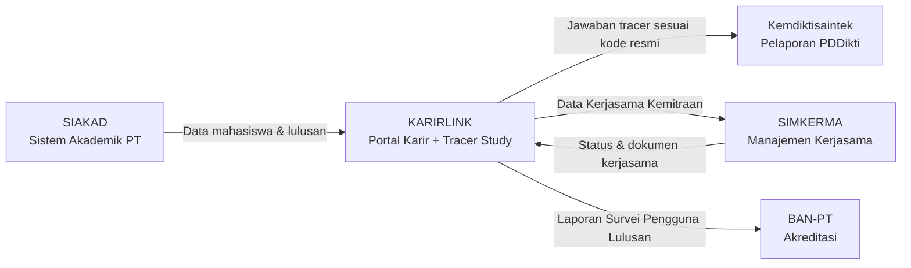

**Peran masing-masing:**

| Sistem | Perannya |
|---|---|
| **SIAKAD** | Sumber data mahasiswa dan lulusan. Karirlink tidak pernah membuat data mahasiswa dari nol. |
| **Karirlink** | Tempat mahasiswa/alumni mencari kerja, dan tempat kampus mengumpulkan data tracer. |
| **SIMKERMA** | Tempat kampus mengelola dokumen dan monitoring kerjasama dengan mitra. |
| **Kemdiktisaintek** | Penerima laporan tracer study untuk IKU dan PDDikti. |
| **BAN-PT** | Penerima laporan Survei Pengguna Lulusan untuk akreditasi. |

---

## 2. Tiga Perubahan Besar

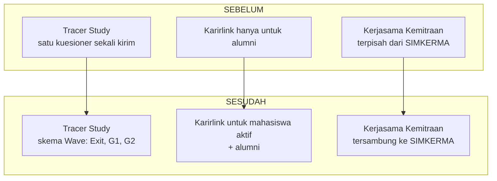

Ketiga perubahan itu diuraikan satu per satu di bawah:

| Sub-bagian | Perubahan |
|---|---|
| [§2.1](#21-perubahan-1--tracer-study-memakai-skema-wave) | Tracer Study memakai skema Wave (Exit → G1 → G2) |
| [§2.2](#22-perubahan-2--karirlink-terbuka-untuk-mahasiswa-aktif) | Karirlink terbuka untuk mahasiswa aktif — termasuk transisi ke alumni, kanal email, dan kasus satu akun banyak kampus |
| [§2.3](#23-perubahan-3--kerjasama-kemitraan-tersambung-ke-simkerma) | Kerjasama Kemitraan tersambung ke SIMKERMA |

---

### 2.1 Perubahan 1 — Tracer Study Memakai Skema Wave

Dulu kuesioner dikirim sekali. Sekarang dibagi menjadi beberapa gelombang, masing-masing dengan tujuan berbeda.

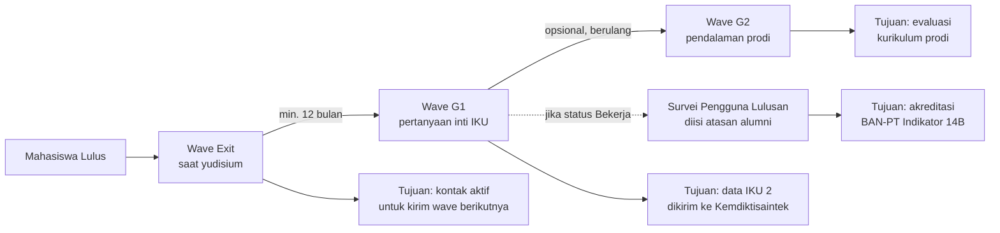

**Kenapa dipecah jadi Wave?**

| Alasan | Penjelasan |
|---|---|
| Kontak alumni cepat basi | Wave Exit merekam email dan HP saat alumni masih mudah dihubungi. |
| Regulasi minta jarak 12 bulan | Data IKU 2 baru sah kalau diambil minimal setahun setelah lulus. |
| Kuesioner panjang bikin alumni berhenti di tengah | Dipecah jadi beberapa gelombang, tiap gelombang lebih pendek. |
| Isian sebelumnya bisa dipakai lagi | Jawaban Wave Exit jadi isian awal Wave G1 — alumni cukup memeriksa. |

**Alur pengisian dalam satu Wave G1:**

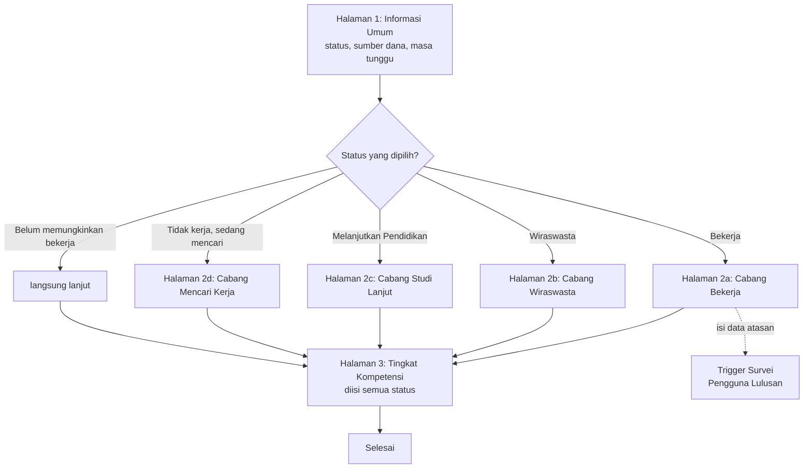

---

### 2.2 Perubahan 2 — Karirlink Terbuka untuk Mahasiswa Aktif

Dulu akun Karirlink baru dibuat saat mahasiswa lulus. Sekarang mahasiswa aktif sudah punya akun.

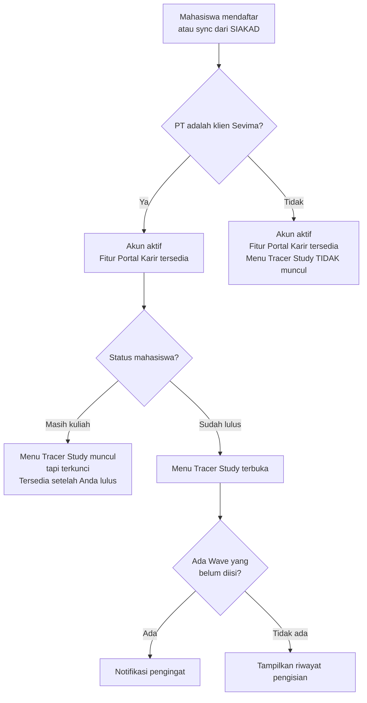

**Tiga kondisi tampilan menu Tracer Study:**

| Kondisi | PT klien Sevima? | Sudah lulus? | Tampilan menu |
|---|---|---|---|
| Tersembunyi | Tidak | — | Menu tidak muncul sama sekali |
| Terkunci | Ya | Belum | Menu muncul, ada keterangan "tersedia setelah lulus" |
| Terbuka | Ya | Sudah | Menu bisa diklik, kuesioner bisa diisi |

**Yang tetap bisa diakses semua orang** (klien maupun non-klien, mahasiswa maupun alumni):

- Melihat dan melamar lowongan
- Mengikuti perusahaan
- Materi persiapan karier
- Mengatur preferensi pekerjaan

---

#### 2.2.1 Transisi Mahasiswa → Alumni

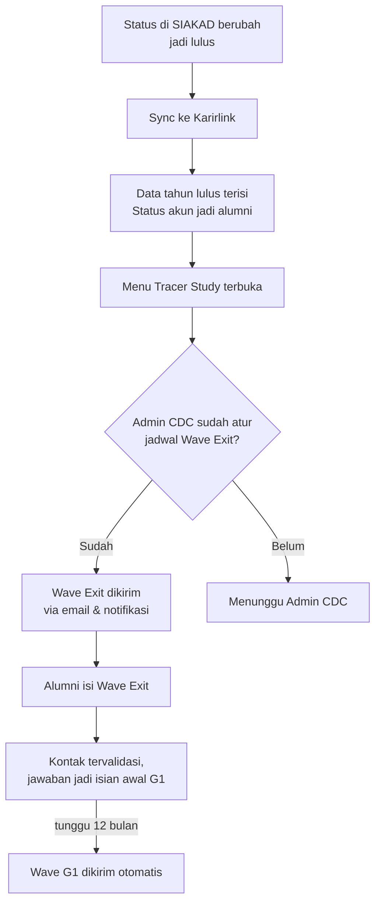

**Mekanisme sync** — dua cara, saling melengkapi:

| Cara | Kapan dipakai |
|---|---|
| Sync otomatis berkala (mingguan) | Default untuk PT yang SIAKAD-nya terintegrasi |
| Sync manual oleh Admin | Saat butuh data segera, mis. setelah yudisium |

> Detail teknis mekanisme sync masih perlu dibahas lebih lanjut.

#### 2.2.2 Email yang Dipakai: Email Pribadi, Bukan Email Kampus

Email yang disync dari SIAKAD ke Karirlink sebaiknya **email pribadi mahasiswa**, bukan email kampus.

**Alasannya:**

| Alasan | Penjelasan |
|---|---|
| Email kampus sering dimatikan setelah lulus | Kalau akun email kampus ditutup, Wave G1 dan G2 tidak akan pernah sampai. |
| Wave G1 dikirim minimal 12 bulan setelah lulus | Pada titik itu, alumni sudah lama tidak memakai email kampus. |
| Alumni memakai email pribadi untuk melamar kerja | Perusahaan menghubungi lewat email yang dipakai alumni sehari-hari. |
| Notifikasi lowongan perlu dibaca | Kalau masuk ke email yang tidak pernah dibuka, fitur Portal Karir jadi tidak berguna. |

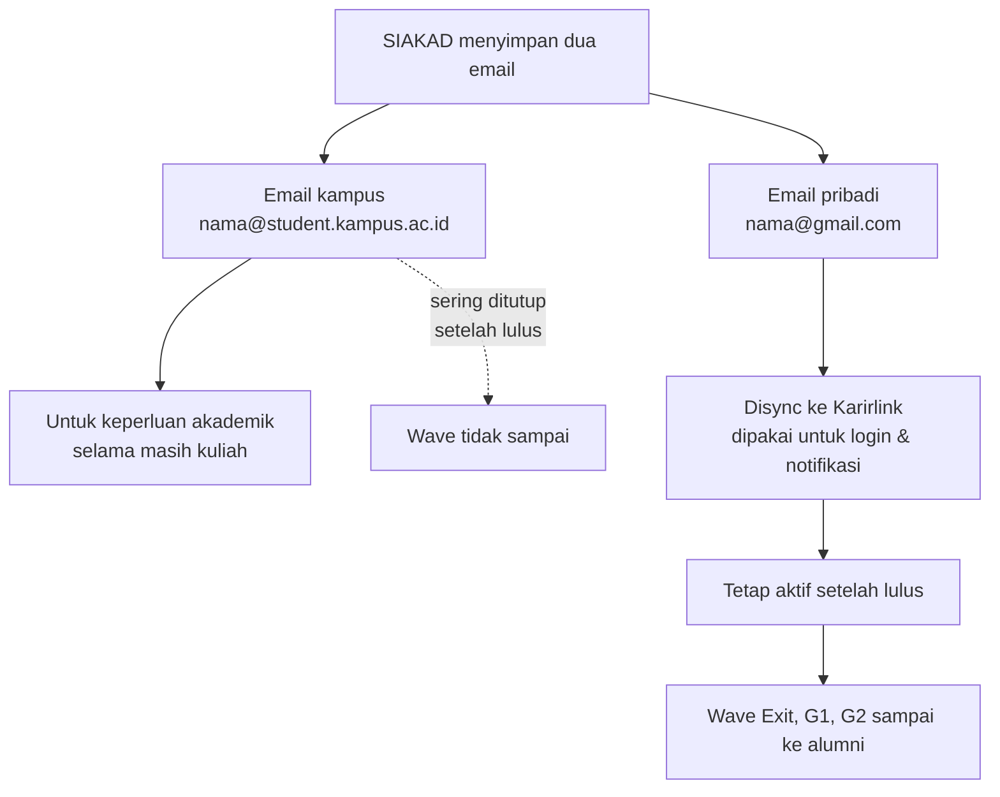

**Konsekuensi yang perlu diantisipasi:**

- **Kalau SIAKAD PT hanya menyimpan email kampus** — perlu ada mekanisme meminta mahasiswa mengisi email pribadi, entah lewat SIAKAD atau langsung di Karirlink saat pertama login.
- **Kalau mahasiswa mengganti email pribadi** — Karirlink perlu mengizinkan alumni memperbarui sendiri, dan perubahan itu jangan tertimpa lagi oleh sync SIAKAD berikutnya.
- **Wave Exit tetap menanyakan email** — supaya alumni bisa memeriksa dan mengoreksi sebelum benar-benar lepas dari kampus.

> Perlu dikonfirmasi ke tim SIAKAD: apakah field email pribadi sudah tersedia dan terisi konsisten di semua PT klien?

---

#### 2.2.3 Satu Akun, Banyak Kampus

Satu orang bisa jadi alumni di lebih dari satu kampus. Akunnya tetap satu, tapi partisipasi tracer-nya terpisah.

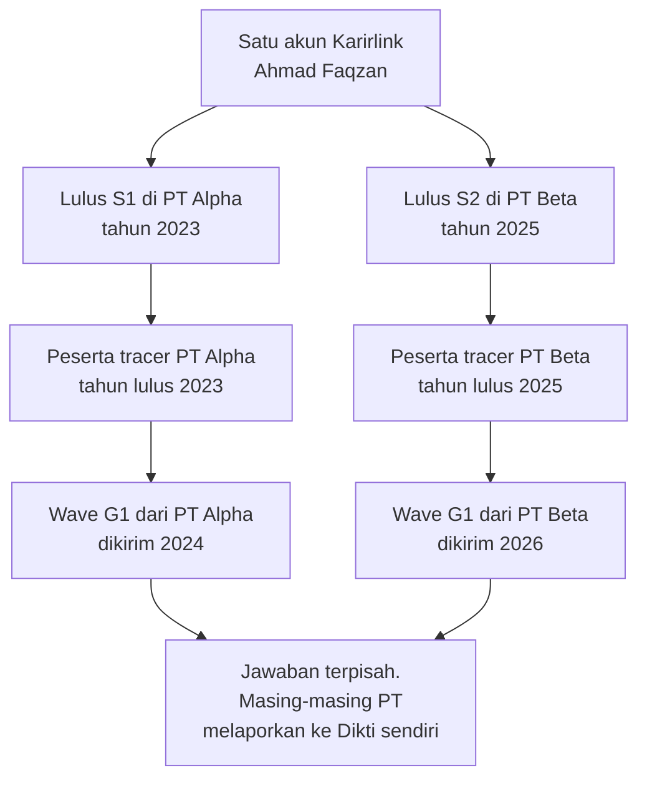

Data jawaban tracer **milik kampus**, bukan milik alumni. Kalau alumni pindah kampus untuk S2, data tracer S1 tetap tersimpan di kampus asal.

---

### 2.3 Perubahan 3 — Kerjasama Kemitraan Tersambung ke SIMKERMA

Karirlink mencatat kerjasama antara kampus dan perusahaan. SIMKERMA mengelola dokumen dan monitoring kerjasama secara lebih lengkap. Keduanya perlu tersambung supaya tidak ada pencatatan ganda.

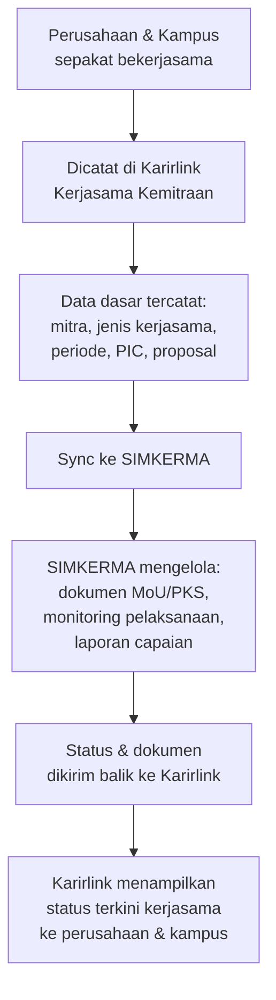

**Pembagian peran:**

| Hal | Karirlink | SIMKERMA |
|---|---|---|
| Titik awal kerjasama | Perusahaan/kampus mengajukan di sini | — |
| Data dasar mitra | Sumber utama (tabel perusahaan) | Menerima dari Karirlink |
| Dokumen MoU / PKS | Unggah proposal awal | Pengelolaan dokumen lengkap |
| Monitoring pelaksanaan | — | Sumber utama |
| Laporan capaian & IKU 6 | — | Sumber utama |
| Tampilan status ke perusahaan | Menampilkan status dari SIMKERMA | — |

**Kenapa perlu tersambung?**

- Perusahaan sudah terdaftar di Karirlink — tidak perlu diinput ulang di SIMKERMA
- Kampus melihat satu daftar kerjasama, bukan dua daftar yang berbeda
- Kerjasama yang lahir dari aktivitas Portal Karir (mis. perusahaan yang rutin merekrut alumni) bisa langsung diformalkan

> Detail bentuk integrasi (API dua arah, satu arah, atau berbagi basis data) masih perlu dibahas.

---

## 3. Alur Data Keseluruhan

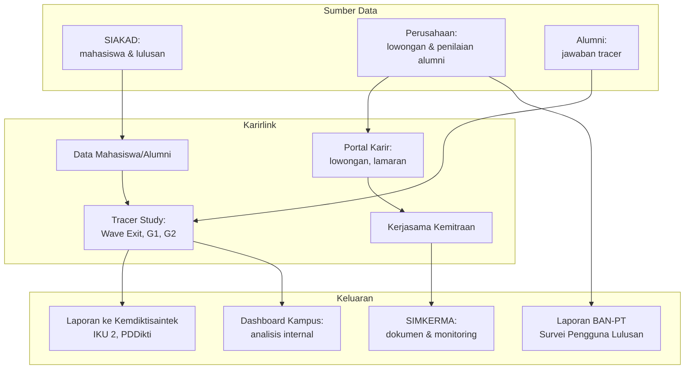


---

## 4. Hierarki Kuesioner Tracer Study

> **Versi skema: 3 layer.** Sebelumnya dokumen ini memakai 4 layer (termasuk Layer "Universitas") dengan Kaprodi sebagai role pengaju pertanyaan prodi. Dua hal itu disederhanakan:
> - Layer **Universitas** dihilangkan — belum dibutuhkan di fase ini. Kalau nanti kampus perlu pertanyaan seragam lintas prodi, layer ini bisa dihidupkan lagi.
> - Role **Kaprodi** tidak dipakai di Karirlink. Pertanyaan prodi (per LAM) disusun langsung oleh Admin CDC, tanpa alur pengajuan/approval.
>
> Rujukan keputusan: `draft-product-roadmap-2.md` §5.4 (Bagian II — Modul Karirlink).

### 4.1 Masalah di Lapangan: Double Kuesioner

Temuan dari diseminasi dengan tim CDC dan pihak prodi: karena sistem sekarang mengizinkan siapa saja membuat kuesioner terpisah, terjadi duplikasi.

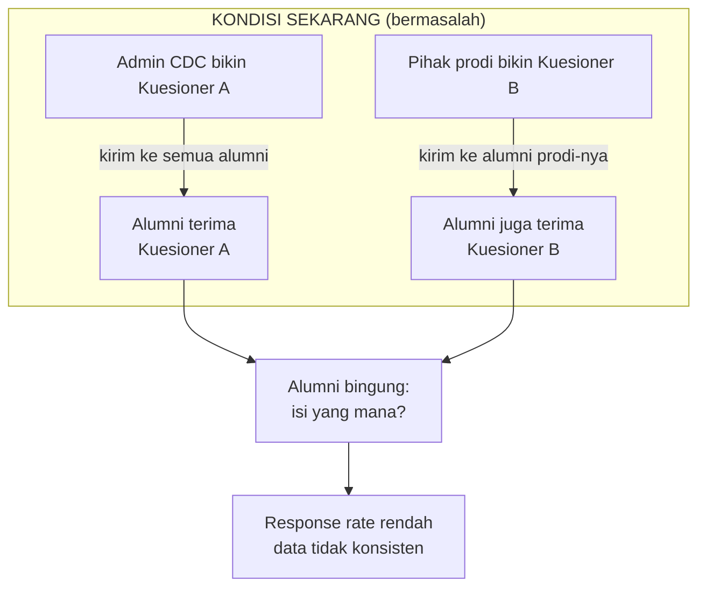

**Akibatnya:**
- Alumni menerima >1 kuesioner — bingung harus isi yang mana
- Sebagian alumni hanya isi salah satu, sebagian lagi tidak isi dua-duanya
- Data tidak tergabung — masing-masing pihak hanya punya data parsial

---

### 4.2 Solusi: Satu Kuesioner, Dikompos dari Layer

Alumni hanya menerima **satu kuesioner per Wave**. Di balik layar, kuesioner itu dikompos dari tiga layer:

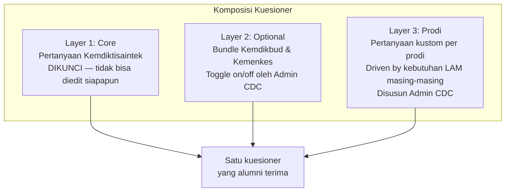

**Apa yang alumni lihat:**

Alumni Prodi Teknik Informatika (LAM Infokom):
```
Halaman 1–3 : Core (Layer 1)              → sama untuk semua prodi
Halaman 4   : Optional (Layer 2, jika on) → sama untuk semua prodi
Halaman 5   : Prodi TI (Layer 3)          → khusus prodi ini, dari LAM Infokom
```

Alumni Prodi Keperawatan (LAM PTKes):
```
Halaman 1–3 : Core (Layer 1)              → sama
Halaman 4   : Optional (Layer 2, jika on) → sama
Halaman 5   : Prodi Kep (Layer 3)         → khusus prodi ini, dari LAM PTKes
```

---

### 4.3 Siapa Melakukan Apa

| Peran | Bisa | Tidak bisa |
|---|---|---|
| **Admin CDC** | Mengaktifkan/nonaktifkan Layer 2. Menyusun pertanyaan Layer 3 per prodi sesuai LAM. Mengirim Wave. Melihat dashboard semua prodi. | — |
| **Alumni** | Mengisi kuesioner yang diterima. Memperbarui data kontak. | Tidak bisa melihat kuesioner atau jawaban prodi/kampus lain. |

---

### 4.4 Flow Penyusunan Pertanyaan Prodi (Layer 3)

Disusun sepenuhnya oleh Admin CDC — tidak ada alur pengajuan antar-peran.

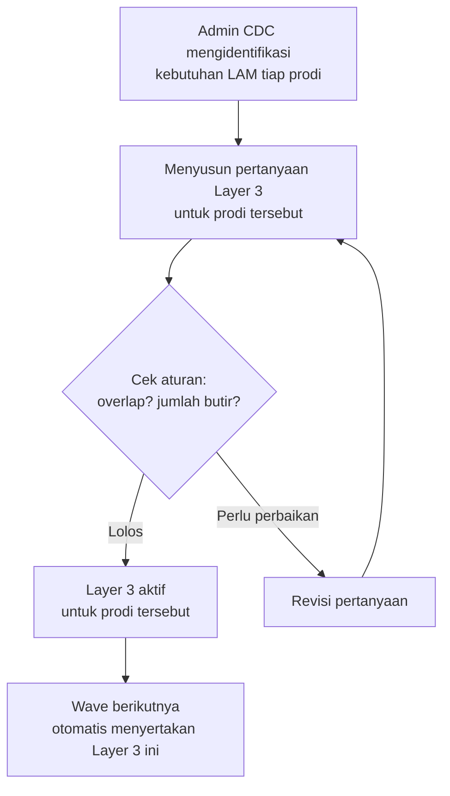

**Aturan penyusunan:**

| Aturan | Detail |
|---|---|
| Pertanyaan tidak boleh overlap dengan Layer 1–2 | Kalau sudah ditanyakan di Core atau Optional, tidak perlu diulang di Layer 3. |
| Ada batas jumlah | Perlu ditetapkan maks berapa butir per prodi (mis. 5–10 butir?) agar kuesioner tidak terlalu panjang. |
| Timing | Layer 3 harus siap **sebelum** Wave dikirim. Kalau Wave sudah jalan, pertanyaan baru berlaku di Wave berikutnya. |
| Format pertanyaan | Harus mengikuti tipe yang didukung sistem (pilihan ganda, skala, teks bebas, dll). |

---

### 4.5 Flow Pengiriman & Ke Mana Data Mengalir

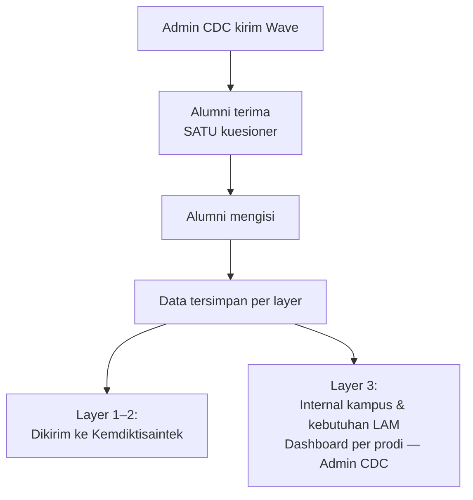

---

### 4.6 Dashboard per Prodi — Apa yang Dilihat Admin CDC

Admin CDC memantau progress tracer study per prodi, bukan hanya agregat kampus. Ini yang membuat kebutuhan LAM tiap prodi bisa ditelusuri.

**Yang ditampilkan per prodi:**

| Informasi | Contoh |
|---|---|
| Total alumni yang harus mengisi | 120 orang |
| Sudah mengisi | 87 (72.5%) |
| Belum mengisi | 33 (27.5%) |
| Daftar nama yang belum isi | Bisa langsung dikirimi reminder |
| Ringkasan jawaban Layer 3 prodi tsb | Agregasi jawaban pertanyaan LAM |

Karena Admin CDC memegang kendali penuh, tidak ada pembatasan akses antar-prodi di dalam satu kampus — batasnya ada di level institusi (Admin CDC hanya melihat data kampusnya sendiri).

---

### 4.7 Catatan Penting

| # | Hal | Detail |
|---|---|---|
| 1 | Pertanyaan LAM belum diterima | Layer 3 saat ini berupa "slot kosong" per prodi — menunggu daftar pertanyaan LAM masing-masing prodi dikumpulkan. Kuesioner tetap bisa jalan dengan Layer 1–2. |
| 2 | Urutan tampil selalu 1→2→3 | Pertanyaan Dikti dulu, baru kustom prodi. Supaya yang wajib pasti terisi duluan sebelum alumni berhenti di tengah. |
| 3 | Data Layer 3 tidak dikirim ke Dikti | Hanya untuk internal kampus dan kebutuhan LAM. |
| 4 | Batas jumlah pertanyaan Layer 3 | Perlu ditetapkan agar response rate tetap tinggi. Rekomendasi: maks 10 butir per prodi. |
| 5 | Perubahan Layer 3 antar Wave | Layer 3 boleh diubah untuk Wave berikutnya — tapi Wave yang sudah berjalan tidak bisa diubah di tengah jalan. |
| 6 | Layer Universitas bila dibutuhkan nanti | Kalau kampus perlu pertanyaan seragam lintas prodi, layer itu disisipkan di antara Layer 2 dan Layer 3, dan penomoran layer prodi bergeser kembali menjadi 4. |
