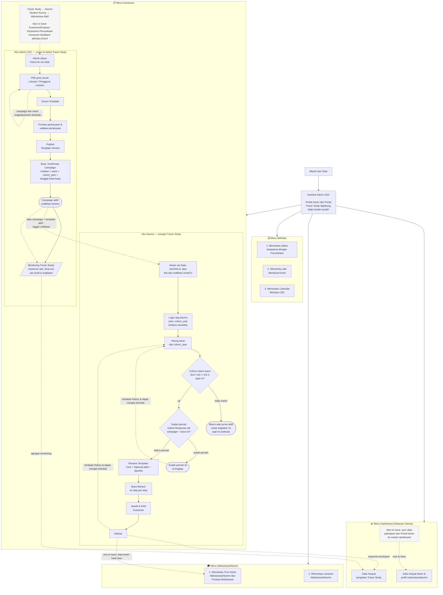

# Alur Aplikasi Karirlink Admin CDC (Gabungan)

Dokumen ini menggabungkan dua diagram yang sebelumnya terpisah menjadi satu alur aplikasi utuh:

- **[karirlink-admin-cdc-menu.mmd.md](./karirlink-admin-cdc-menu.mmd.md)** — struktur menu/navigasi aplikasi Karirlink Admin CDC (Dashboard, Kuesioner, Mahasiswa/Alumni, Aktivitas).
- **[tracer-study-flow.mmd.md](./tracer-study-flow.mmd.md)** — alur proses bisnis detail untuk fitur Tracer Study, sisi Admin CDC maupun sisi Alumni.

Kaitannya: diagram menu adalah **kerangka navigasi** aplikasi, sedangkan alur Tracer Study adalah **proses detail yang berjalan di dalam menu "Kuesioner"**. Hasil dari proses itu (response yang masuk, status campaign) mengalir balik ke menu **Dashboard** (riwayat pengisian) dan menu **Mahasiswa/Alumni** (tren karier).

---

## Diagram Gabungan

---

## Detail per Bagian

### 1. Entry & Shell Aplikasi

Semua pengguna — baik Admin CDC maupun Alumni — masuk lewat **Gate**. Setelah masuk, mereka berada di dalam satu aplikasi **Karirlink Admin CDC**, yang menyatukan apa yang sebelumnya dua portal terpisah: **Portal Karier** dan **Portal Tracer Study**. Ini adalah keputusan produk kunci di balik diagram menu asli — tidak ada lagi konteks "pindah aplikasi" antara mengelola karier dan mengelola tracer study.

### 2. Menu Dashboard

Halaman utama setelah login. Menampilkan dua sumber data utama:

| Data | Sumber |
| --- | --- |
| Riwayat karier & profil mahasiswa/alumni | Portal Karier |
| Riwayat pengisian Tracer Study | Hasil alur Kuesioner (lihat §3) — akumulasi dari `B11` (submit selesai) dan `A8` (agregat monitoring) |

**Nice to have**: jika alumni mendapat pekerjaan lewat Portal Karier, datanya sync otomatis ke master dashboard — tidak perlu re-entry manual.

### 3. Menu Kuesioner — Alur Tracer Study

Menu ini adalah tempat proses dari `tracer-study-flow.mmd.md` berjalan. Ada dua jenis kuesioner aktif saat ini (Tracer Study untuk Alumni, Student Survey untuk Mahasiswa Aktif), dengan rencana nice-to-have untuk Kuesioner Kerjasama Perusahaan dan Kuesioner Feedback Event.

#### 3a. Sisi Admin CDC (`A1`–`A8`)

Alur linear untuk menyiapkan & memonitor satu campaign survei:

1. **A1–A2**: Admin masuk dan memilih jenis survei (Lulusan atau Pengguna Lulusan).
2. **A3–A5**: Menyusun template pertanyaan, melakukan preview & validasi, lalu publish sebagai *Template Version* (versioning eksplisit — perubahan template tidak menimpa versi yang sudah dipakai campaign berjalan).
3. **A6**: Membuat/konfirmasi *Campaign* — kombinasi institusi, wave, cohort_year, dan periode buka-tutup. Loop `A2 -.-> A2` menunjukkan admin bisa membuat campaign paralel lain untuk angkatan/wave yang berbeda.
4. **A7**: Campaign aktif → notifikasi terkirim ke alumni target (lihat §3b, `B1`).
5. **A8**: Monitoring real-time — response rate, drop-out, breakdown per prodi & angkatan. Data ini juga mengalir ke Dashboard (`DASH2`).

#### 3b. Sisi Alumni (`B1`–`B11`)

Alur pengisian kuesioner oleh alumni, dipicu oleh campaign yang aktif di sisi admin:

1. **B1–B2**: Alumni mengakses (via Gate, karirlink.id, atau link notifikasi email) dan login — `cohort_year` terbaca otomatis dari NIM.
2. **B3–B4**: Sistem menghitung *wave* dari cohort_year, lalu cek apakah cohort ini match dengan wave (Exit / GS-I / GS-II) yang sedang berjalan.
   - Tidak match → **B5**: belum ada survei aktif untuk angkatan ini saat ini.
3. **B6**: Jika match, cek apakah alumni sudah pernah submit response untuk campaign + wave ini.
   - Sudah pernah → **B7**: ditampilkan sebagai sudah lengkap.
   - Belum pernah → **B8–B11**: resolve template (Core + Optional aktif + Specific) → buka wizard → isi step-per-step → submit → selesai.
4. Baik `B7` maupun `B11` bisa kembali memicu `B3` di kesempatan lain — selama masih ada history dan wave/campaign baru yang relevan (mis. alumni yang sama disurvei lagi di wave GS-II setelah sebelumnya mengisi Exit Survey).

### 4. Menu Mahasiswa/Alumni

Dua sub-fitur monitoring: tren karier & prestasi mahasiswa/alumni, dan pemantauan lamaran kerja. Nice to have: data hasil isian Tracer Study (`B11`) turut memperkaya data tren karier yang ditampilkan di sini.

### 5. Menu Aktivitas

Mencakup pemantauan kerjasama perusahaan, pembuatan & pemantauan event, serta kalender aktivitas CDC. Bagian ini tidak berinteraksi langsung dengan alur Tracer Study saat ini, tapi menjadi sumber untuk kuesioner nice-to-have (evaluasi kerjasama, feedback event) yang disebut di §3.

---

## Titik Integrasi Data Antar Menu

| Dari | Ke | Keterangan |
| --- | --- | --- |
| `A7` (campaign aktif) | `B1` (akses alumni) | Trigger notifikasi email/link ke alumni target campaign |
| `A7` | `A8` | Campaign aktif langsung masuk radar monitoring |
| `B11` (submit selesai) | `DASH2` (riwayat pengisian) | Setiap response tersimpan menambah riwayat di Dashboard |
| `A8` (agregat monitoring) | `DASH2` | Angka response rate/drop-out ikut ditampilkan di Dashboard |
| `B11` | `MHS1` (tren karier) | *Nice to have* — data isian tracer study memperkaya tren karier alumni |
| Portal Karier (dapat kerjaan) | `DASH1` (profil/riwayat karier) | *Nice to have* — sync otomatis ke master dashboard |

## Legenda Notasi

| Bentuk | Arti |
| --- | --- |
| Persegi panjang | Langkah proses / halaman |
| Diamond `{ }` | Keputusan / percabangan |
| Stadium `([ ])` | Kondisi akhir / terminal (selesai, tidak ada aksi lanjut) |
| Parallelogram `[/ /]` | Tampilan data / output (dashboard monitoring) |
| Kotak putus-putus (abu-abu) | Fitur **nice to have** — belum jadi prioritas utama |
| Panah putus-putus `-.->` | Aliran data / trigger antar bagian, bukan urutan langkah langsung |
| Panah penuh `-->` | Urutan langkah langsung dalam satu alur |

---

## Ringkasan Status Fitur

| Fitur | Status |
| --- | --- |
| Menu Dashboard (riwayat karier + riwayat pengisian) | Utama |
| Kuesioner: Tracer Study (Alumni) | Utama |
| Kuesioner: Student Survey (Mahasiswa Aktif) | Utama |
| Kuesioner: Evaluasi Kerjasama Perusahaan | Nice to have |
| Kuesioner: Feedback Event | Nice to have |
| Menu Mahasiswa/Alumni (tren karier, lamaran) | Utama |
| Menu Aktivitas (kerjasama, event, kalender) | Utama |
| Sync data pekerjaan Portal Karier → Dashboard | Nice to have |
| Sync data isian Tracer Study → tren karier | Nice to have |
