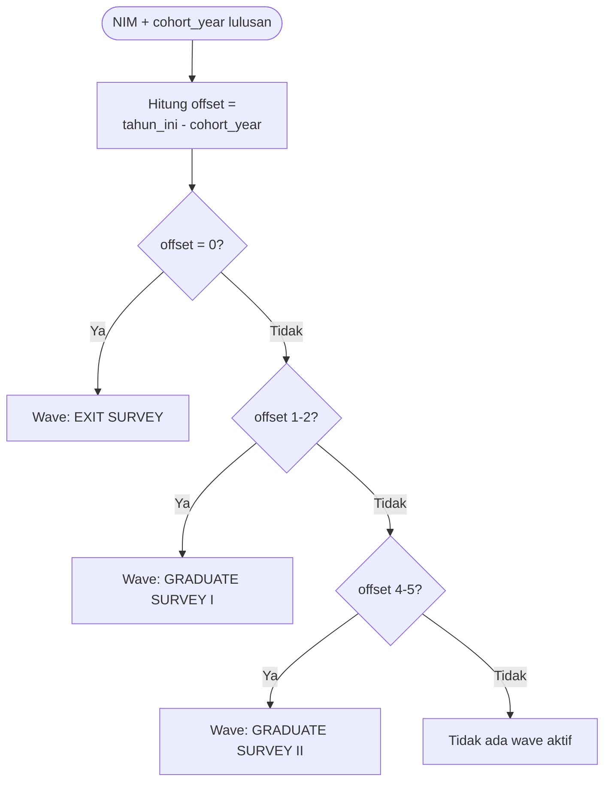

# Cohort Matching Logic — FOX-983

Dokumentasi logic penentuan Wave dari `cohort_year` (nim → tahun lulus → wave), dan status "sudah pernah isi vs belum pernah isi", sebagaimana diminta di deliverable FOX-983. Rujukan detail: `docs/about-tracer/Konsep-Pertanyaan-Core-Optional-Specific-untuk-Template-Quisioner.md` bagian 9 (formula lengkap, tabel irisan antar-angkatan, ERD).

## 1. Dari NIM ke Wave

`cohort_year` (tahun lulus) diisi **sekali**, saat data lulusan masuk ke sistem (bulk-import dari PDDIKTI/SIAKAD: NIM, Nama, Prodi, Tahun Lulus) — bukan diketik manual tiap kali ada survei baru, dan bukan disimpan ulang di tiap baris jawaban.

```
offset = tahun_kalender_sekarang - cohort_year

offset = 0        -> Wave: EXIT SURVEY
offset = 1 s.d. 2  -> Wave: GRADUATE SURVEY I (GS-I)
offset = 4 s.d. 5  -> Wave: GRADUATE SURVEY II (GS-II)
offset lainnya     -> Tidak ada wave aktif ("istirahat" tahun ini)
```

Tiap wave punya rentang **2 tahun kalender** (bukan 1 titik) — satu angkatan tetap di wave yang sama selama 2 tahun berturut-turut. Konsekuensinya: irisan antar-angkatan itu **normal**, bukan edge case — pada tahun tertentu bisa ada 3-4 campaign berjalan paralel untuk angkatan berbeda dengan wave berbeda. Sistem tidak boleh berasumsi "satu campaign aktif per institusi per waktu".



## 2. Beda penerapan formula ini di 2 skenario A/B

Formula di atas **sama** untuk kedua skenario — bedanya siapa yang mengontrol targeting di sisi admin, dan apakah alumni bisa melihat/mengubah hasilnya:

| | Skenario A — Alur Sederhana | Skenario B — Isi Kembali/Edit |
|---|---|---|
| Yang menentukan target kirim | Admin pilih **Tahun Lulus** langsung saat kirim (tidak ada konsep Campaign/Wave di sisi admin) | Admin buat **Campaign** = institusi + wave + cohort_year + tanggal buka-tutup (formula 9.1 dipakai sistem untuk *usulan* wave, admin bisa override) |
| Yang alumni lihat | Read-only: "Sistem mendeteksi Anda termasuk Wave: GS-I" — tidak bisa diubah alumni maupun admin per-individu | Sama (read-only bagi alumni), tapi admin bisa override `target_cohort_year` di level Campaign |
| Kalau alumni offset di luar 0/1-2/4-5 | Halaman "Belum Ada Survei Aktif" (`tracer-study-belum-aktif.html`) | Sama |

## 3. Status "Sudah Pernah Isi" vs "Belum Pernah Isi"

Status ini dicek per kombinasi **(respondent_id, campaign_id)** — bukan per alumni secara global (satu alumni bisa "sudah isi" untuk Exit Survey tapi "belum isi" untuk GS-I, karena keduanya `campaign_id` berbeda).

```
respondent membuka link survey
  -> resolve wave dari cohort_year (bagian 1)
  -> cari RESPONSE existing utk (respondent_id, campaign_id aktif saat ini)
       ditemukan?  -> "Sudah Pernah Isi"
       tidak ada?  -> "Belum Pernah Isi" -> buka Wizard
```

**Skenario A (Alur Sederhana):** status "Sudah Pernah Isi" = **terminal, terkunci**. Halaman `tracer-study-sudah-mengisi.html` hanya menampilkan ringkasan, tidak ada aksi lanjutan.

**Skenario B (Isi Kembali/Edit):** status "Sudah Pernah Isi" **tidak mengunci** — alumni tetap bisa:
- Melihat **riwayat** semua `RESPONSE` miliknya lintas campaign/wave (halaman baru `riwayat-pengisian.html`)
- Menekan **"Edit Jawaban"** untuk campaign yang masih `open_date`–`close_date` aktif, kembali ke Wizard dengan jawaban sebelumnya (di mockup ini didemokan sebagai link statis ke `tracer-study-form.html`, bukan pre-fill data sungguhan — lihat catatan di README masing-masing skenario)

Konsekuensi model data: skenario B butuh **riwayat/versi response per (respondent_id, campaign_id)**, bukan cuma flag boolean "sudah submit" — ini yang jadi trade-off utama dibanding skenario A (lihat `PERBANDINGAN.md`).
